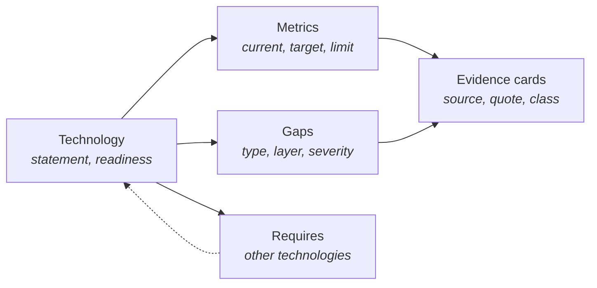

# Escape Velocity

Escape velocity is the speed at which a rocket stops falling back. A technology has one too: the
point where it works well enough, cheaply enough and reliably enough to carry on by itself.
**Escape Velocity is an open atlas of what each technology still needs to get there**: where it
stands today, the target that would make it useful, the physical limit behind that target, the gaps
in between, the other technologies it waits on, and the research that could close each gap.

Every number has a source. Every technology is a node in one graph, so a bottleneck shared by
quantum computing, fusion and medicine shows up as one thing, not three.

**Explore it at [scape-velocity.github.io/escape-velocity](https://scape-velocity.github.io/escape-velocity/)**:
the distance to target of every technology, the dependency graph, and filters over the gaps and
the evidence. On GitHub, start with [STATUS.md](STATUS.md): every domain, headline metric, critical
gap and the technologies the rest of the atlas depends on most.

## How it works

- **A technology** is a capability with a measurable target: a fault-tolerant quantum computer,
  a blood test that finds cancer at stage I, direct air capture at 100 USD per tonne.
- **Three numbers per metric**: the best value demonstrated so far, the target with its rationale,
  and the physical limit where one exists. The distance is shown in orders of magnitude.
- **Gaps** are classified by type (scientific unknown, engineering, fundamental limit, data,
  manufacturing, cost, regulation, supply chain), layer and severity.
- **Dependencies are technologies too**, each tracked with its own metrics and gaps. A gap held open
  by a dependency points to it.
- **Evidence cards** carry every number: the source, a verbatim quote, the conditions and a class
  (established, reported, extrapolation, speculation). A script checks each card against its source.

The full model is in [docs/model.md](docs/model.md).

## Domains

| | | |
|---|---|---|
| [Computing](atlas/computing/README.md) | [Quantum](atlas/quantum/README.md) | [Artificial intelligence](atlas/ai/README.md) |
| [Health](atlas/health/README.md) | [Biotechnology](atlas/biotech/README.md) | [Neurotechnology](atlas/neurotech/README.md) |
| [Energy](atlas/energy/README.md) | [Climate](atlas/climate/README.md) | [Materials](atlas/materials/README.md) |
| [Water](atlas/water/README.md) | [Food and agriculture](atlas/food/README.md) | [Space](atlas/space/README.md) |
| [Enablers](atlas/enablers/README.md) | | |

Enablers are the shared infrastructure many technologies wait on: cryogenics, heat removal, power
electronics, photonics, lasers.

## Agents and skills

The atlas is kept current by people and agents following the same procedures. The skills in
[skills/](skills/) work with Claude Code and other agents that read the Agent Skills format:

| Skill | What it does |
|---|---|
| [scout-literature](skills/scout-literature/SKILL.md) | Searches OpenAlex, arXiv, Crossref, PubMed, ClinicalTrials.gov and Semantic Scholar for work that could close a gap |
| [review-evidence](skills/review-evidence/SKILL.md) | Checks each evidence card against its source: identifier, title, year, author, quote |
| [define-technology](skills/define-technology/SKILL.md) | Adds a technology with its statement, metric and target |
| [decompose-technology](skills/decompose-technology/SKILL.md) | Maps what a technology depends on and what stands in its way |
| [assess-readiness](skills/assess-readiness/SKILL.md) | Sets a readiness level on TRL, MRL or clinical phases, with evidence |
| [find-neglected-gaps](skills/find-neglected-gaps/SKILL.md) | Finds bottlenecks many technologies wait on and few people research |
| [cross-domain-transfer](skills/cross-domain-transfer/SKILL.md) | Looks for approaches from one field that could close a gap in another |
| [weekly-brief](skills/weekly-brief/SKILL.md) | Summarizes what is new for the mapped technologies |

An MCP server gives any agent read access to the atlas and the literature search:
`list_technologies`, `technology`, `gaps`, `dependencies`, `bottlenecks`, `evidence`,
`search_literature`, `abstract` and `count_literature`. Claude Code loads it from
[.mcp.json](.mcp.json) when you open the repository; other clients run
`python3 tools/mcp_server.py` from the repository root.

The whole atlas is also published as one file,
[atlas.json](https://scape-velocity.github.io/escape-velocity/atlas.json) ([format](docs/export.md)),
and for language models as [llms.txt](https://scape-velocity.github.io/escape-velocity/llms.txt).

Every change, from a person or an agent, is a pull request reviewed by a person. Agents write
evidence as unverified; only curators verify it.

## The Alan Machine

[The Alan Machine](https://the-alan-machine.github.io/alan-machine/) is an open-source book about a
hypothetical supercomputer at the physical limits of computation. Its Building Alan dossiers track
real hardware against those limits. Escape Velocity shares its metrics and its kinds of claim, links
each technology to the pages that discuss it, and maps quantum computing and AI first because both
projects need them ([decision 0008](docs/decisions/0008-relationship-with-the-alan-machine.md)).

## Roadmap

| Stage | What |
|---|---|
| 0 | Data model, taxonomy, checks, generated pages, skills, a local read-only MCP server, first technologies in every domain |
| 1 | JSON export, `llms.txt` and a static explorer with the graph (shipped); a hosted copy of the MCP server over the export |
| 2 | Scheduled scouting that opens pull requests with proposed evidence; curators for the main technologies |
| 3 | Limits computed by the book's `alan` library; dossiers of The Alan Machine pulling pinned versions of the atlas |

## Contributing

One sourced number is a real contribution. See [CONTRIBUTING.md](CONTRIBUTING.md); agents read
[AGENTS.md](AGENTS.md). Decisions are in [docs/decisions/](docs/decisions/README.md).

Out of scope: weapons, dual-use research of concern, surveillance aimed at people, investment
advice and medical advice ([decision 0001](docs/decisions/0001-purpose-and-scope.md)).

## License

Data (taxonomy, technologies, evidence cards) under [CC0 1.0](LICENSE-DATA); text under
[CC BY 4.0](LICENSE); code under [Apache 2.0](LICENSE-CODE). See [LICENSE](LICENSE).
