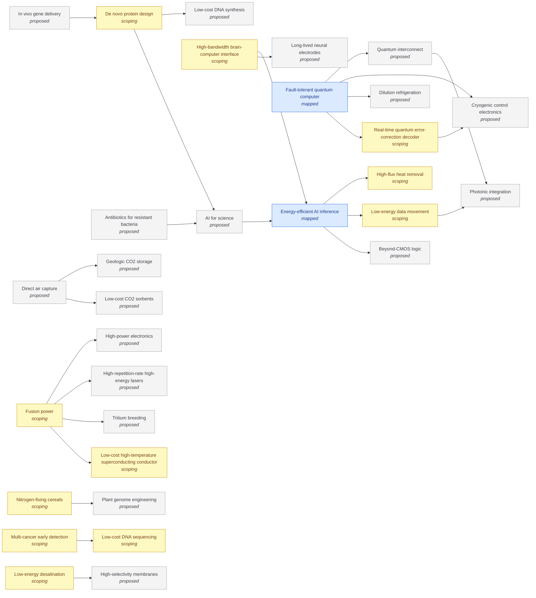

# Status of the atlas

<!-- Generated by tools/generate.py from atlas/, evidence/ and taxonomy/. Do not edit by hand. -->

Where every technology stands, what blocks it, and the evidence behind each number. The atlas
status says how much of a technology is mapped; readiness says how mature the technology is.

**35 technologies** in 13 domains (2 mapped, 12 scoping, 21 proposed). **26 open gaps**, 7 of them critical. **51 evidence cards** (51 machine-checked).

## Domains

| Domain | Technologies | Mapped or tracked | Open gaps | Critical |
|---|---|---|---|---|
| [Computing](atlas/computing/README.md) | 2 | 0 | 0 | 0 |
| [Quantum technologies](atlas/quantum/README.md) | 3 | 1 | 6 | 1 |
| [Artificial intelligence](atlas/ai/README.md) | 2 | 1 | 5 | 1 |
| [Health and medicine](atlas/health/README.md) | 2 | 0 | 2 | 1 |
| [Biotechnology](atlas/biotech/README.md) | 5 | 0 | 2 | 0 |
| [Neurotechnology](atlas/neurotech/README.md) | 2 | 0 | 1 | 0 |
| [Energy](atlas/energy/README.md) | 4 | 0 | 1 | 1 |
| [Climate and environment](atlas/climate/README.md) | 2 | 0 | 1 | 1 |
| [Materials and manufacturing](atlas/materials/README.md) | 3 | 0 | 0 | 0 |
| [Water](atlas/water/README.md) | 1 | 0 | 2 | 0 |
| [Food and agriculture](atlas/food/README.md) | 1 | 0 | 3 | 2 |
| [Space](atlas/space/README.md) | 2 | 0 | 2 | 0 |
| [Enabling technologies](atlas/enablers/README.md) | 6 | 0 | 1 | 0 |

## Headline metrics

One number per technology, the one that best says how far it has to go.

| Technology | Domain | Atlas status | Readiness | Headline metric | Current | Target | Gap to target |
|---|---|---|---|---|---|---|---|
| [Energy-efficient AI inference](atlas/ai/energy-efficient-inference.md) | ai | mapped | TRL 6 (6 of 9) | Energy per token | 0.72 J | 0.07 J | 1.0 orders of magnitude |
| [De novo protein design](atlas/biotech/de-novo-protein-design.md) | biotech | scoping | not assessed | Design success rate | 10% | 90% | 1.0 orders of magnitude |
| [Low-cost DNA sequencing](atlas/biotech/low-cost-dna-sequencing.md) | biotech | scoping | not assessed | Cost per human genome | 90 USD | 10 USD | 1.0 orders of magnitude |
| [Beyond-CMOS logic](atlas/computing/beyond-cmos-logic.md) | computing | proposed | not assessed | Energy per operation | – | – | – |
| [Low-energy data movement](atlas/computing/low-energy-data-movement.md) | computing | scoping | TRL 4 (4 of 9) | Energy per bit moved | 6.5 × 10⁻¹³ J | 10⁻¹³ J | 0.8 orders of magnitude |
| [Dilution refrigeration](atlas/enablers/dilution-refrigeration.md) | enablers | proposed | not assessed | Cooling power | 0.002 W | – | – |
| [High-flux heat removal](atlas/enablers/heat-removal.md) | enablers | scoping | TRL 4 (4 of 9) | Heat flux removed | 10⁷ W m^-2 | 10⁸ W m^-2 | 1.0 orders of magnitude |
| [Photonic integration](atlas/enablers/photonic-integration.md) | enablers | proposed | not assessed | Waveguide propagation loss | 1.77 dB m^-1 | – | – |
| [Fusion power](atlas/energy/fusion-power.md) | energy | scoping | not assessed | Target gain | 1.5 | 100 | 1.8 orders of magnitude |
| [Nitrogen-fixing cereals](atlas/food/nitrogen-fixing-cereals.md) | food | scoping | not assessed | Nitrogen from fixation | 82% | 100% | 18 points |
| [Multi-cancer early detection](atlas/health/multi-cancer-early-detection.md) | health | scoping | not assessed | Sensitivity | 16.8% | 50% | 33.2 points |
| [Low-cost high-temperature superconducting conductor](atlas/materials/low-cost-hts-conductor.md) | materials | scoping | not assessed | Conductor cost | 100 USD kA^-1 m^-1 | 20 USD kA^-1 m^-1 | 0.7 orders of magnitude |
| [High-bandwidth brain-computer interface](atlas/neurotech/high-bandwidth-bci.md) | neurotech | scoping | not assessed | Communication rate | 62 words min^-1 | 160 words min^-1 | 0.4 orders of magnitude |
| [Fault-tolerant quantum computer](atlas/quantum/fault-tolerant-quantum-computer.md) | quantum | mapped | TRL 4 (4 of 9) | Logical error per cycle | 0.00143 | 10⁻¹² | 9.2 orders of magnitude |
| [Real-time quantum error-correction decoder](atlas/quantum/real-time-qec-decoder.md) | quantum | scoping | not assessed | Decoder latency | 6.3 × 10⁻⁵ s | 10⁻⁵ s | 0.8 orders of magnitude |
| [Low-cost access to orbit](atlas/space/low-cost-access-to-orbit.md) | space | scoping | not assessed | Launch cost | 3 868 USD kg^-1 | 300 USD kg^-1 | 1.1 orders of magnitude |
| [Low-energy desalination](atlas/water/low-energy-desalination.md) | water | scoping | not assessed | Specific energy consumption | 3 kWh m^-3 | 1 kWh m^-3 | 0.5 orders of magnitude |

## Most depended on

A breakthrough here moves every technology that requires it.

| Technology | Required by | Domains reached | Atlas status |
|---|---|---|---|
| [AI for science](atlas/ai/ai-for-science.md) | 2 | biotech, health | proposed |
| [Energy-efficient AI inference](atlas/ai/energy-efficient-inference.md) | 2 | ai, neurotech | mapped |
| [Cryogenic control electronics](atlas/enablers/cryogenic-control-electronics.md) | 2 | quantum | proposed |
| [Photonic integration](atlas/enablers/photonic-integration.md) | 2 | computing, quantum | proposed |
| [De novo protein design](atlas/biotech/de-novo-protein-design.md) | 1 | biotech | scoping |
| [Low-cost DNA sequencing](atlas/biotech/low-cost-dna-sequencing.md) | 1 | health | scoping |
| [Low-cost DNA synthesis](atlas/biotech/low-cost-dna-synthesis.md) | 1 | biotech | proposed |
| [Plant genome engineering](atlas/biotech/plant-genome-engineering.md) | 1 | food | proposed |
| [Geologic CO2 storage](atlas/climate/geologic-co2-storage.md) | 1 | climate | proposed |
| [Beyond-CMOS logic](atlas/computing/beyond-cmos-logic.md) | 1 | ai | proposed |
| [Low-energy data movement](atlas/computing/low-energy-data-movement.md) | 1 | ai | scoping |
| [Dilution refrigeration](atlas/enablers/dilution-refrigeration.md) | 1 | quantum | proposed |
| [High-flux heat removal](atlas/enablers/heat-removal.md) | 1 | ai | scoping |
| [High-repetition-rate high-energy lasers](atlas/enablers/high-repetition-rate-lasers.md) | 1 | energy | proposed |
| [High-power electronics](atlas/enablers/power-electronics.md) | 1 | energy | proposed |

## Critical gaps

| Gap | Technology | Type | Status | Blocked by |
|---|---|---|---|---|
| Moving weights and cache costs more than the arithmetic | [Energy-efficient AI inference](atlas/ai/energy-efficient-inference.md) | engineering | active | [Low-energy data movement](atlas/computing/low-energy-data-movement.md) |
| Projected cost stays in the hundreds of USD per tonne | [Direct air capture](atlas/climate/direct-air-capture.md) | cost | open | [Low-cost CO2 sorbents](atlas/materials/low-cost-co2-sorbents.md), [Geologic CO2 storage](atlas/climate/geologic-co2-storage.md) |
| Gain of about 100 at power-plant repetition rates | [Fusion power](atlas/energy/fusion-power.md) | scientific-unknown | active | [High-repetition-rate high-energy lasers](atlas/enablers/high-repetition-rate-lasers.md) |
| Fixation shown in a landrace, not in high-yield cultivars | [Nitrogen-fixing cereals](atlas/food/nitrogen-fixing-cereals.md) | scientific-unknown | active | – |
| A working nitrogenase inside plant cells | [Nitrogen-fixing cereals](atlas/food/nitrogen-fixing-cereals.md) | engineering | active | [Plant genome engineering](atlas/biotech/plant-genome-engineering.md) |
| Low sensitivity for stage I cancers | [Multi-cancer early detection](atlas/health/multi-cancer-early-detection.md) | scientific-unknown | active | [Low-cost DNA sequencing](atlas/biotech/low-cost-dna-sequencing.md) |
| Qubit count and control wiring | [Fault-tolerant quantum computer](atlas/quantum/fault-tolerant-quantum-computer.md) | engineering | active | [Cryogenic control electronics](atlas/enablers/cryogenic-control-electronics.md), [Dilution refrigeration](atlas/enablers/dilution-refrigeration.md) |

## Dependency graph

An arrow points from a technology to one it depends on.

