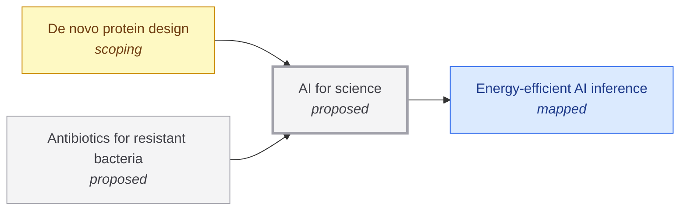

# AI for science

<!-- Generated by tools/generate.py from atlas/ai/ai-for-science.toml. Do not edit by hand. -->

> AI systems that propose, test and refine scientific hypotheses, designs and experiments well enough that their results are confirmed in the laboratory at a rate that speeds up discovery.

| | |
|---|---|
| Domain | [Artificial intelligence](README.md) |
| Atlas status | **proposed**: Named, with a statement and a scope; nothing mapped yet |
| Readiness | not assessed |
| Serves | UN SDG 3 Good health and well-being, 9 Industry, innovation and infrastructure |
| Curators | none yet; see [how to become one](../../CONTRIBUTING.md#curators) |
| Last reviewed | never |

## Scope

In scope: models and agents used to generate and rank candidates (molecules, proteins, materials, experiments) and to close the loop with laboratory or simulation feedback. Out of scope: the energy cost of running them, covered by ai/energy-efficient-inference; the specific discoveries they enable, covered by technologies such as biotech/de-novo-protein-design and health/antibiotics-for-resistant-bacteria.

## Dependencies

### Depends on

| Technology | Atlas status | Why | What it must deliver |
|---|---|---|---|
| [Energy-efficient AI inference](../../atlas/ai/energy-efficient-inference.md) | mapped | Screening and agentic loops run many model calls per experiment, so the energy and cost per token set how far discovery loops can scale. | – |

### Required by

| Technology | Why | What it needs from this one |
|---|---|---|
| [De novo protein design](../../atlas/biotech/de-novo-protein-design.md) | Design methods are deep-learning models trained on protein structures. | – |
| [Antibiotics for resistant bacteria](../../atlas/health/antibiotics-for-resistant-bacteria.md) | Machine-learning models screen and generate candidate molecules far faster than screening libraries by hand. | – |

## Search terms

Where the `scout-literature` skill starts: `AI for scientific discovery`; `autonomous laboratory self-driving lab`; `AI scientist hypothesis generation validated experiment`.
