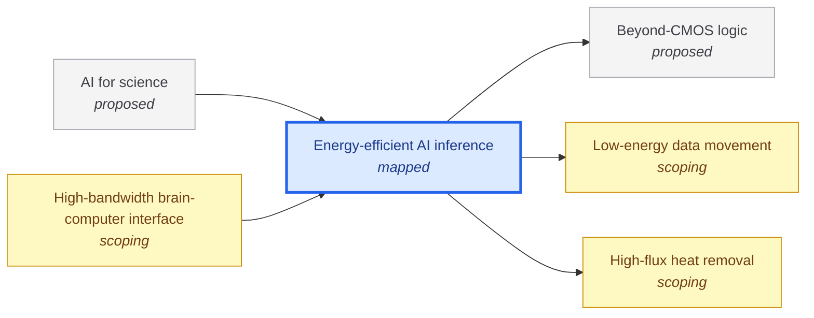

# Energy-efficient AI inference

<!-- Generated by tools/generate.py from atlas/ai/energy-efficient-inference.toml. Do not edit by hand. -->

> Running trained AI models to answer queries at a small fraction of today's energy per generated token, across the whole stack from the chip to the cooling plant, so that wider use of AI does not need proportionally more electricity.

| | |
|---|---|
| Domain | [Artificial intelligence](README.md) |
| Atlas status | **mapped**: Every metric has a current value with a source and a target; the main gaps are written |
| Readiness | TRL 6 (6 of 9) ([elsworth2025measuring](../../evidence/elsworth2025measuring.toml), [oviedo2026energy](../../evidence/oviedo2026energy.toml)) |
| Readiness note | Efficiency gains are demonstrated in production serving (a 33x reduction in energy per median Gemini Apps prompt over one year, company-reported), but the order-of-magnitude hardware gaps below are at laboratory or prototype level. |
| Horizon | 2030s |
| Serves | UN SDG 7 Affordable and clean energy, 9 Industry, innovation and infrastructure, 13 Climate action |
| Curators | none yet; see [how to become one](../../CONTRIBUTING.md#curators) |
| Last reviewed | 2026-10-04 |
| In The Alan Machine | [Building Alan: energy per token](https://the-alan-machine.github.io/alan-machine/building-alan/energy-per-token/index.html) |

## Scope

In scope: the energy drawn to serve a trained language model, measured per token or per query, including accelerator, memory, interconnect, host and cooling overhead. Out of scope: the energy of training (not mapped yet); the logic devices, data movement and cooling that inference depends on, covered by computing/beyond-cmos-logic, computing/low-energy-data-movement and enablers/heat-removal; and what AI is used for, covered by ai/ai-for-science.

## Metrics

| Metric | Current | Target | Physical limit | Gap to target | Target to limit |
|---|---|---|---|---|---|
| **Energy per token** (headline) | 0.72 J (2026-08-01, [vellaisamy2026characterization](../../evidence/vellaisamy2026characterization.toml)) | 0.07 J | – | 1.0 orders of magnitude | – |

- **Energy per token**: measured as: GPU energy over the inference window divided by output tokens, as the source defines it; strongly dependent on model size, batch size, context and output length. The current value is for a 1B-parameter dense model, the favorable end of the range.; current: At 10 output tokens the same setup measures 7.46 J/token, so the number is only comparable under stated conditions. as_of is the approximate preprint month; the abstract gives no date.; target: One order of magnitude below the current value under the same conditions. Oviedo et al. (Joule 2026) estimate 8 to 20 times line-of-sight energy reductions across models, serving systems and hardware; 10 times sits inside that range and needs no new device physics. ([oviedo2026energy](../../evidence/oviedo2026energy.toml)).

## Dependencies

### Depends on

| Technology | Atlas status | Why | What it must deliver |
|---|---|---|---|
| [Beyond-CMOS logic](../../atlas/computing/beyond-cmos-logic.md) | proposed | Arithmetic in the accelerator is bounded by the switching energy of CMOS logic, which is estimated to allow only about two hundred times more efficiency than current microprocessors. | – |
| [Low-energy data movement](../../atlas/computing/low-energy-data-movement.md) | scoping | Token generation reads the model weights and the key-value cache from memory for every token, so memory and chip-to-chip traffic carries a large share of the energy. | Energy per bit moved: 10⁻¹³ J; Energy per bit moved between memory and processor at or below 0.1 pJ, so that streaming weights costs a few watts per terabyte per second. |
| [High-flux heat removal](../../atlas/enablers/heat-removal.md) | scoping | Delivered power and cooling capacity bound how many accelerators fit in a rack and therefore the tokens produced per site. | – |

### Required by

| Technology | Why | What it needs from this one |
|---|---|---|
| [AI for science](../../atlas/ai/ai-for-science.md) | Screening and agentic loops run many model calls per experiment, so the energy and cost per token set how far discovery loops can scale. | – |
| [High-bandwidth brain-computer interface](../../atlas/neurotech/high-bandwidth-bci.md) | Decoding runs a neural network on the neural signal; running it in a wearable or implanted device needs low energy per inference. | – |

## Gaps

### Moving weights and cache costs more than the arithmetic

severity **critical**; status **active**; type engineering; layer system; blocks Energy per token.

Each generated token streams the model weights and the key-value cache through memory, so memory traffic, not arithmetic, tends to bind the energy per token. The best published electrical die-to-die link measures 0.65 pJ/bit in a prototype, an interface-only figure. Closing the gap means fewer bytes moved (quantization, cache compression, sparse attention) and cheaper bytes.

Blocked by: [Low-energy data movement](../../atlas/computing/low-energy-data-movement.md) (scoping).

Evidence: [park2024pjbit](../../evidence/park2024pjbit.toml).

### Decoding is bound by memory bandwidth, not compute

severity **high**; status **active**; type engineering; layer device; blocks Energy per token.

Small batches leave the arithmetic units idle while the memory system is saturated. The measured token energy falls from 7.46 to 0.72 J/token as output length grows from 10 to 512 tokens at batch 16, because fixed costs are amortized; batching gains shrink as context grows (6.31x at 512 tokens of context against 1.17x at 4K for 10 output tokens).

Blocked by: [Low-energy data movement](../../atlas/computing/low-energy-data-movement.md) (scoping).

Evidence: [vellaisamy2026characterization](../../evidence/vellaisamy2026characterization.toml).

### Idle capacity and small batches waste energy

severity **high**; status **promising**; type engineering; layer deployment; blocks Energy per token.

Production energy per prompt includes idle machine capacity and data-center overhead, not only active accelerator power. Google reports a 33x reduction in energy per median Gemini Apps text prompt over one year from software efficiency and clean-energy procurement (the abstract states the combined effect on energy and does not separate the two). Further gains depend on batching, routing and model choice.

Evidence: [elsworth2025measuring](../../evidence/elsworth2025measuring.toml), [oviedo2026energy](../../evidence/oviedo2026energy.toml).

### CMOS logic has a ceiling of about two hundred times today's efficiency

severity **medium**; status **open**; type fundamental-limit; layer physics.

Ho, Erdil and Besiroglu estimate a ceiling of 4.7e15 FP4 operations per joule for CMOS microprocessors, roughly two hundred times current microprocessors, from switching, interconnect capacitance and leakage. The atlas has no sourced current FLOP-per-joule value for deployed accelerators yet, so this gap has no metric of its own.

Blocked by: [Beyond-CMOS logic](../../atlas/computing/beyond-cmos-logic.md) (proposed).

Evidence: [ho2023limits](../../evidence/ho2023limits.toml).

### Delivered power and cooling bound token output

severity **medium**; status **active**; type engineering; layer deployment; blocks Energy per token.

At deployment scale the binding constraint can move from peak compute to delivered data-center power, cooling capacity and PUE. Embedded microfluidic cooling supports about 1e3 W/cm2; accelerator power density keeps rising.

Blocked by: [High-flux heat removal](../../atlas/enablers/heat-removal.md) (scoping).

Evidence: [wei2026microfluidic](../../evidence/wei2026microfluidic.toml).

## Evidence

| Card | Source | Class | Checked |
|---|---|---|---|
| [elsworth2025measuring](../../evidence/elsworth2025measuring.toml) | Elsworth et al. (2025), [Measuring the environmental impact of delivering AI at Google Scale](https://arxiv.org/abs/2508.15734), arXiv | reported | machine-checked |
| [oviedo2026energy](../../evidence/oviedo2026energy.toml) | Oviedo et al. (2026), [Energy use of AI inference, efficiency pathways, and test-time scaling](https://doi.org/10.1016/j.joule.2026.102430), Joule | established | machine-checked |
| [vellaisamy2026characterization](../../evidence/vellaisamy2026characterization.toml) | Vellaisamy et al. (2026), [Characterization of Request and Token Energy Costs for LLM Inference Workloads on GPU Platforms](https://arxiv.org/abs/2608.28044), arXiv | reported | machine-checked |
| [park2024pjbit](../../evidence/park2024pjbit.toml) | Park et al. (2024), [A 0.65-pJ/bit 3.6-TB/s/mm I/O Interface with XTalk Minimizing Affine Signaling for Next-Generation HBM with High Interconnect Density](https://arxiv.org/abs/2404.05119), arXiv | reported | machine-checked |
| [ho2023limits](../../evidence/ho2023limits.toml) | Ho et al. (2023), [Limits to the Energy Efficiency of CMOS Microprocessors](https://arxiv.org/abs/2312.08595), arXiv | extrapolation | machine-checked |
| [wei2026microfluidic](../../evidence/wei2026microfluidic.toml) | Wei et al. (2026), [Microfluidic cooling for high-heat-flux chips: Thermal-path compression, bottleneck migration and near-junction limits](https://doi.org/10.70401/tx.2026.0024), Thermo-X | established | machine-checked |

## Search terms

Where the `scout-literature` skill starts: `LLM inference energy per token`; `energy consumption of large language model serving`; `inference energy efficiency GPU`.
