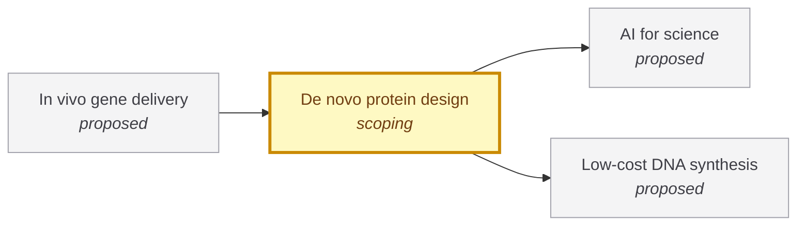

# De novo protein design

<!-- Generated by tools/generate.py from atlas/biotech/de-novo-protein-design.toml. Do not edit by hand. -->

> Designing a protein with a chosen structure or function from scratch, by computer, so that the first designs tested in the laboratory work as intended.

| | |
|---|---|
| Domain | [Biotechnology](README.md) |
| Atlas status | **scoping**: Dependencies and the headline metric are mapped; the current value has a source |
| Readiness | not assessed |
| Serves | UN SDG 3 Good health and well-being, 9 Industry, innovation and infrastructure |
| Curators | none yet; see [how to become one](../../GOVERNANCE.md#curators) |
| Last reviewed | 2026-10-04 |

## Scope

In: computational design of new protein binders, enzymes and assemblies that do not exist in nature, and the experimental success rate of the designs. Out: directed evolution of natural proteins, and delivery of the proteins into the body (biotech/in-vivo-gene-delivery).

## Metrics

| Metric | Current | Target | Physical limit | Gap to target | Target to limit |
|---|---|---|---|---|---|
| **Design success rate** (headline) | 10% (2025-01-01, [pacesa2025one](../../evidence/pacesa2025one.toml)) | 90% | – | 1.0 orders of magnitude | – |

- **Design success rate**: measured as: De novo protein binders, experimental success rate across the targets tested by the method's developers.; current: Lower end of a reported range of 10 to 100% across targets. as_of is the publication year. Independent groups report lower rates for other methods (see the gap).; target: The goal of the one-design-one-binder approach named in the BindCraft paper: with a success rate of 90%, testing three designs gives more than a 99.9% chance of at least one working binder (1 minus 0.1 cubed), so no high-throughput screening is needed. Atlas reasoning, not an agency target. ([pacesa2025one](../../evidence/pacesa2025one.toml)).

## Dependencies

### Depends on

| Technology | Atlas status | Why | What it must deliver |
|---|---|---|---|
| [AI for science](../../atlas/ai/ai-for-science.md) | proposed | Design methods are deep-learning models trained on protein structures. | – |
| [Low-cost DNA synthesis](../../atlas/biotech/low-cost-dna-synthesis.md) | proposed | Every designed protein must be encoded as synthetic DNA before it can be expressed and tested. | – |

### Required by

| Technology | Why | What it needs from this one |
|---|---|---|
| [In vivo gene delivery](../../atlas/biotech/in-vivo-gene-delivery.md) | Designed binders and capsid proteins can redirect vectors to specific cell types. | – |

## Gaps

### Success rate varies widely between targets and between groups

severity **high**; status **active**; type scientific-unknown; layer device; blocks Design success rate.

The developers of one pipeline report experimental success rates of 10 to 100% depending on the target. An earlier study found the overall design success rate low and raised it nearly 10-fold with deep-learning filtering. An independent group testing another method on six targets, five designs each, reported that most targets gave no working binder.

Blocked by: [AI for science](../../atlas/ai/ai-for-science.md) (proposed).

Evidence: [pacesa2025one](../../evidence/pacesa2025one.toml), [bennett2023improving](../../evidence/bennett2023improving.toml), [jiang2025rfdiffusion](../../evidence/jiang2025rfdiffusion.toml).

## Evidence

| Card | Source | Class | Checked |
|---|---|---|---|
| [pacesa2025one](../../evidence/pacesa2025one.toml) | Pacesa et al. (2025), [One-shot design of functional protein binders with BindCraft](https://doi.org/10.1038/s41586-025-09429-6), Nature | established | machine-checked |
| [bennett2023improving](../../evidence/bennett2023improving.toml) | Bennett et al. (2023), [Improving de novo protein binder design with deep learning](https://doi.org/10.1038/s41467-023-38328-5), Nature Communications | established | machine-checked |
| [jiang2025rfdiffusion](../../evidence/jiang2025rfdiffusion.toml) | Jiang et al. (2025), [RFdiffusion Exhibits Low Success Rate in De Novo Design of Functional Protein Binders for Biochemical Detection](https://doi.org/10.1101/2025.02.07.636769), bioRxiv | reported | machine-checked |

## Search terms

Where the `scout-literature` skill starts: `de novo protein binder design`; `RFdiffusion`; `experimental success rate designed proteins`.
