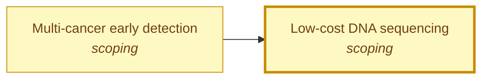

# Low-cost DNA sequencing

<!-- Generated by tools/generate.py from atlas/biotech/low-cost-dna-sequencing.toml. Do not edit by hand. -->

> Reading the sequence of a human genome, at about 30-fold coverage, for a cost low enough that sequencing is a routine step in research, screening and diagnosis.

| | |
|---|---|
| Domain | [Biotechnology](README.md) |
| Atlas status | **scoping**: Dependencies and the headline metric are mapped; the current value has a source |
| Readiness | not assessed |
| Serves | UN SDG 3 Good health and well-being, 9 Industry, innovation and infrastructure |
| Curators | none yet; see [how to become one](../../GOVERNANCE.md#curators) |
| Last reviewed | 2026-10-04 |

## Scope

In: instruments, chemistry and workflows that read DNA, and the cost per human genome. Out: the interpretation of the sequence, and DNA writing (biotech/low-cost-dna-synthesis).

## Metrics

| Metric | Current | Target | Physical limit | Gap to target | Target to limit |
|---|---|---|---|---|---|
| **Cost per human genome** (headline) | 90 USD (2022-01-01, [almogy2022cost](../../evidence/almogy2022cost.toml)) | 10 USD | – | 1.0 orders of magnitude | – |

- **Cost per human genome**: measured as: One human genome at about 30-fold coverage; platform developer's figure per gigabase scaled to a genome.; current: Derived: 1 USD per Gb times 30 times 3 Gb. Preprint by the platform developer; the cost basis of the per-gigabase figure is not defined in the abstract. as_of is the preprint year.; target: Atlas working target, not set by an agency: one order of magnitude below the current value, where the sequencing cost of a genome would be comparable to a routine laboratory assay. NHGRI publishes the cost history but sets no target. ([wetterstrand2023dna](../../evidence/wetterstrand2023dna.toml)).

## Dependencies

### Required by

| Technology | Why | What it needs from this one |
|---|---|---|
| [Multi-cancer early detection](../../atlas/health/multi-cancer-early-detection.md) | Methylation and fragment-based tests read cell-free DNA by sequencing, so test price follows sequencing price. | – |

## Gaps

### Reagent price is not the cost of a genome

severity **medium**; status **open**; type cost; layer deployment; blocks Cost per human genome.

The per-gigabase price quoted by a platform developer leaves out what NHGRI counts as production cost: labor, instruments amortized over three years, informatics and data submission. The atlas has no independent figure for the full cost of a 30-fold human genome today, so the current value is a derived, developer-reported number.

Evidence: [wetterstrand2023dna](../../evidence/wetterstrand2023dna.toml), [almogy2022cost](../../evidence/almogy2022cost.toml).

## Evidence

| Card | Source | Class | Checked |
|---|---|---|---|
| [almogy2022cost](../../evidence/almogy2022cost.toml) | Almogy et al. (2022), [Cost-efficient whole genome-sequencing using novel mostly natural sequencing-by-synthesis chemistry and open fluidics platform](https://doi.org/10.1101/2022.05.29.493900), bioRxiv | reported | machine-checked |
| [wetterstrand2023dna](../../evidence/wetterstrand2023dna.toml) | Wetterstrand (2023), [DNA Sequencing Costs: Data](https://www.genome.gov/about-genomics/fact-sheets/DNA-Sequencing-Costs-Data), NHGRI Genome Sequencing Program | established | machine-checked |

## Search terms

Where the `scout-literature` skill starts: `low-cost whole genome sequencing`; `cost per genome sequencing`; `sequencing-by-synthesis cost per gigabase`.
