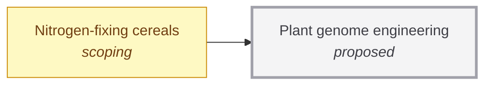

# Plant genome engineering

<!-- Generated by tools/generate.py from atlas/biotech/plant-genome-engineering.toml. Do not edit by hand. -->

> Making precise, heritable changes to the genomes of crop plants quickly and across species, without the long tissue-culture steps that limit many crops today.

| | |
|---|---|
| Domain | [Biotechnology](README.md) |
| Atlas status | **proposed**: Named, with a statement and a scope; nothing mapped yet |
| Readiness | not assessed |
| Serves | UN SDG 2 Zero hunger |
| Curators | none yet; see [how to become one](../../CONTRIBUTING.md#curators) |
| Last reviewed | never |

## Scope

In: editing and transformation methods for crop plants and the regeneration of whole plants from edited cells. Out: the choice of trait (for example food/nitrogen-fixing-cereals) and field regulation of the resulting crops.

## Dependencies

### Required by

| Technology | Why | What it needs from this one |
|---|---|---|
| [Nitrogen-fixing cereals](../../atlas/food/nitrogen-fixing-cereals.md) | Every route to a self-fertilizing cereal needs many coordinated edits to the plant genome. | – |

## Search terms

Where the `scout-literature` skill starts: `plant genome editing CRISPR crops`; `plant transformation regeneration bottleneck`; `gene editing cereals`.
