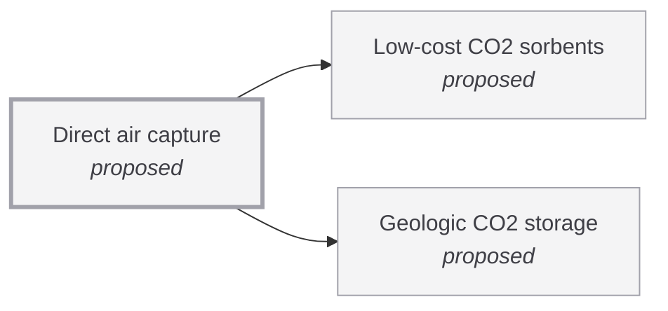

# Direct air capture

<!-- Generated by tools/generate.py from atlas/climate/direct-air-capture.toml. Do not edit by hand. -->

> Plants that remove CO2 from ambient air and store it durably, at a cost low enough to remove gigatonnes per year.

| | |
|---|---|
| Domain | [Climate and environment](README.md) |
| Atlas status | **proposed**: Named, with a statement and a scope; nothing mapped yet |
| Readiness | not assessed |
| Serves | UN SDG 13 Climate action |
| Curators | none yet; see [how to become one](../../GOVERNANCE.md#curators) |
| Last reviewed | never |

## Scope

In: capture of CO2 from air by sorbents or solvents, with transport and geological storage. Out: capture at point sources, biological and mineral removal, and the storage site itself (climate/geologic-co2-storage).

## Dependencies

### Depends on

| Technology | Atlas status | Why | What it must deliver |
|---|---|---|---|
| [Low-cost CO2 sorbents](../../atlas/materials/low-cost-co2-sorbents.md) | proposed | The sorbent sets the capture capacity, the regeneration energy and a large part of the plant's cost. | – |
| [Geologic CO2 storage](../../atlas/climate/geologic-co2-storage.md) | proposed | Removal counts only if the CO2 stays out of the air for centuries; the storage is also part of the cost per tonne. | – |

## Gaps

### Projected cost stays in the hundreds of USD per tonne

severity **critical**; status **open**; type cost; layer deployment.

Design and learning-curve estimates put the levelized cost of capture in the hundreds of USD per tonne: 94 to 232 USD/t for a designed aqueous-KOH plant (capture only, a design not an operating plant), and 341 to 374 USD/t of CO2 net removed with transport and storage at 1 Gt-CO2 per year of cumulative capacity. No source found for the cost of a plant operating today. Closing the gap needs cheaper sorbents, lower regeneration energy and cheaper storage.

Blocked by: [Low-cost CO2 sorbents](../../atlas/materials/low-cost-co2-sorbents.md) (proposed), [Geologic CO2 storage](../../atlas/climate/geologic-co2-storage.md) (proposed).

Evidence: [keith2018process](../../evidence/keith2018process.toml), [sievert2024considering](../../evidence/sievert2024considering.toml).

## Evidence

| Card | Source | Class | Checked |
|---|---|---|---|
| [keith2018process](../../evidence/keith2018process.toml) | Keith (2018), [A Process for Capturing CO2 from the Atmosphere](https://doi.org/10.1016/j.joule.2018.05.006), Joule | extrapolation | machine-checked |
| [sievert2024considering](../../evidence/sievert2024considering.toml) | Sievert (2024), [Considering technology characteristics to project future costs of direct air capture](https://doi.org/10.1016/j.joule.2024.02.005), Joule | extrapolation | machine-checked |

## Search terms

Where the `scout-literature` skill starts: `direct air capture cost`; `direct air capture energy requirement`; `DACCS deployment`.
