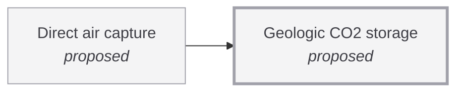

# Geologic CO2 storage

<!-- Generated by tools/generate.py from atlas/climate/geologic-co2-storage.toml. Do not edit by hand. -->

> Injection of CO2 into deep rock formations at gigatonne-per-year scale, with monitoring that shows it stays there.

| | |
|---|---|
| Domain | [Climate and environment](README.md) |
| Atlas status | **proposed**: Named, with a statement and a scope; nothing mapped yet |
| Readiness | not assessed |
| Serves | UN SDG 13 Climate action |
| Curators | none yet; see [how to become one](../../GOVERNANCE.md#curators) |
| Last reviewed | never |

## Scope

In: saline aquifers and depleted fields, including injectivity, capacity, monitoring and leakage risk. Out: mineralization in basalt as a capture route, and capture itself (climate/direct-air-capture).

## Dependencies

### Required by

| Technology | Why | What it needs from this one |
|---|---|---|
| [Direct air capture](../../atlas/climate/direct-air-capture.md) | Removal counts only if the CO2 stays out of the air for centuries; the storage is also part of the cost per tonne. | – |

## Search terms

Where the `scout-literature` skill starts: `geologic CO2 storage capacity`; `CO2 injection saline aquifer monitoring`; `CO2 leakage risk storage`.
