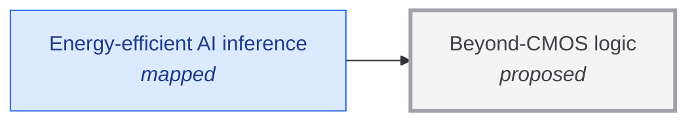

# Beyond-CMOS logic

<!-- Generated by tools/generate.py from atlas/computing/beyond-cmos-logic.toml. Do not edit by hand. -->

> Logic that performs a computation at far less energy per operation than silicon CMOS can, by steeper switches, reversible or adiabatic operation, or superconducting and other devices, down toward the thermodynamic limit.

| | |
|---|---|
| Domain | [Computing](README.md) |
| Atlas status | **proposed**: Named, with a statement and a scope; nothing mapped yet |
| Readiness | not assessed |
| Serves | UN SDG 9 Industry, innovation and infrastructure |
| Curators | none yet; see [how to become one](../../CONTRIBUTING.md#curators) |
| Last reviewed | never |

## Scope

In scope: devices and circuits for logic operations, measured by energy per operation at the device and with cooling and power delivery included. Out of scope: moving data between memory and processor, covered by computing/low-energy-data-movement; removing the heat, covered by enablers/heat-removal; quantum logic, covered by the quantum domain.

## Metrics

| Metric | Current | Target | Physical limit | Gap to target | Target to limit |
|---|---|---|---|---|---|
| **Energy per operation** (headline) | – | – | 2.87 × 10⁻²¹ J | – | – |

- **Energy per operation**: measured as: Energy dissipated per logic operation at the device. No sourced current value yet; see the report.; limit: Landauer bound for erasing one bit at 300 K, kT ln 2 with k = 1.380649e-23 J/K, about 2.87e-21 J. It bounds logically irreversible operations; reversible logic can in principle go lower per operation, at the price of speed..

## Dependencies

### Required by

| Technology | Why | What it needs from this one |
|---|---|---|
| [Energy-efficient AI inference](../../atlas/ai/energy-efficient-inference.md) | Arithmetic in the accelerator is bounded by the switching energy of CMOS logic, which is estimated to allow only about two hundred times more efficiency than current microprocessors. | – |

## Search terms

Where the `scout-literature` skill starts: `energy per operation logic device femtojoule`; `reversible computing adiabatic logic`; `superconducting logic energy`; `steep-slope transistor tunnel FET negative capacitance`.
