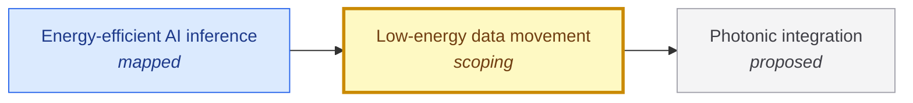

# Low-energy data movement

<!-- Generated by tools/generate.py from atlas/computing/low-energy-data-movement.toml. Do not edit by hand. -->

> Moving bits between memory and processor and between chips at a small fraction of today's energy per bit, by shorter and denser electrical links, in-package memory and optical interconnects.

| | |
|---|---|
| Domain | [Computing](README.md) |
| Atlas status | **scoping**: Dependencies and the headline metric are mapped; the current value has a source |
| Readiness | TRL 4 (4 of 9) ([park2024pjbit](../../evidence/park2024pjbit.toml)) |
| Readiness note | The best figure found is a 28 nm prototype die-to-die interface; no deployed system figure is sourced yet. |
| Horizon | 2030s |
| Serves | UN SDG 9 Industry, innovation and infrastructure |
| Curators | none yet; see [how to become one](../../GOVERNANCE.md#curators) |
| Last reviewed | 2026-10-04 |
| In The Alan Machine | [Building Alan: data movement](https://the-alan-machine.github.io/alan-machine/building-alan/data-movement/index.html) |

## Scope

In scope: energy per bit of memory interfaces and chip-to-chip links, including the transceiver on both ends. Out of scope: the logic that computes on the data, covered by computing/beyond-cmos-logic; the photonic chips themselves, covered by enablers/photonic-integration.

## Metrics

| Metric | Current | Target | Physical limit | Gap to target | Target to limit |
|---|---|---|---|---|---|
| **Energy per bit moved** (headline) | 6.5 × 10⁻¹³ J (2024-04-01, [park2024pjbit](../../evidence/park2024pjbit.toml)) | 10⁻¹³ J | – | 0.8 orders of magnitude | – |

- **Energy per bit moved**: measured as: Interface energy of an electrical die-to-die link over a silicon interposer, transceiver only; a prototype, not a deployed memory system.; current: 0.65 pJ/bit. as_of is the approximate preprint month; the abstract gives no date.; target: Atlas-set reasoning, not an agency target: at 0.1 pJ/bit, an accelerator streaming 10 TB/s (8e13 bit/s, an assumed HBM-class rate) spends 8 W on the link, against 52 W at the current 0.65 pJ/bit; this brings interconnect energy below a few percent of a kilowatt-class accelerator..

## Dependencies

### Depends on

| Technology | Atlas status | Why | What it must deliver |
|---|---|---|---|
| [Photonic integration](../../atlas/enablers/photonic-integration.md) | proposed | Optical links promise low energy per bit over longer distances than electrical links, and need integrated photonic chips to be made in volume. | – |

### Required by

| Technology | Why | What it needs from this one |
|---|---|---|
| [Energy-efficient AI inference](../../atlas/ai/energy-efficient-inference.md) | Token generation reads the model weights and the key-value cache from memory for every token, so memory and chip-to-chip traffic carries a large share of the energy. | Energy per bit moved: 10⁻¹³ J; Energy per bit moved between memory and processor at or below 0.1 pJ, so that streaming weights costs a few watts per terabyte per second. |

## Evidence

| Card | Source | Class | Checked |
|---|---|---|---|
| [park2024pjbit](../../evidence/park2024pjbit.toml) | Park et al. (2024), [A 0.65-pJ/bit 3.6-TB/s/mm I/O Interface with XTalk Minimizing Affine Signaling for Next-Generation HBM with High Interconnect Density](https://arxiv.org/abs/2404.05119), arXiv | reported | machine-checked |

## Search terms

Where the `scout-literature` skill starts: `energy per bit die-to-die interface`; `HBM interface energy pJ/bit`; `co-packaged optics energy per bit`; `processing in memory data movement energy`.
