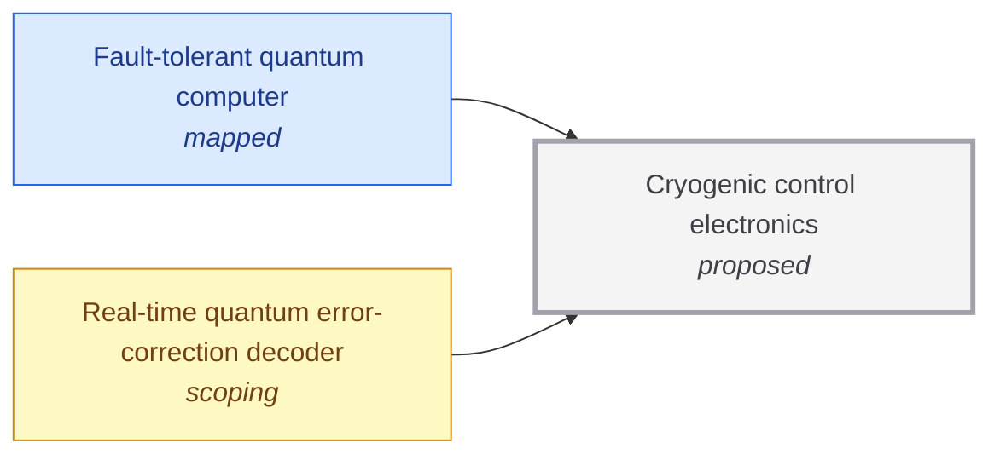

# Cryogenic control electronics

<!-- Generated by tools/generate.py from atlas/enablers/cryogenic-control-electronics.toml. Do not edit by hand. -->

> Electronics that operate at cryogenic temperatures next to the qubits and generate control signals and read out results, replacing one line from room temperature per qubit.

| | |
|---|---|
| Domain | [Enabling technologies](README.md) |
| Atlas status | **proposed**: Named, with a statement and a scope; nothing mapped yet |
| Readiness | not assessed |
| Serves | UN SDG 9 Industry, innovation and infrastructure |
| Curators | none yet; see [how to become one](../../GOVERNANCE.md#curators) |
| Last reviewed | never |

## Scope

In scope: cryo-CMOS, superconducting digital logic and photonic links used to control and read out qubits in the cryostat. Out of scope: the qubits (quantum/fault-tolerant-quantum-computer) and the decoder algorithm (quantum/real-time-qec-decoder).

## Dependencies

### Required by

| Technology | Why | What it needs from this one |
|---|---|---|
| [Fault-tolerant quantum computer](../../atlas/quantum/fault-tolerant-quantum-computer.md) | One coaxial line per qubit does not scale to a million qubits; control and readout electronics must sit in the cold. | – |
| [Real-time quantum error-correction decoder](../../atlas/quantum/real-time-qec-decoder.md) | The decoder reads syndromes from the control system, and placing it near the qubits shortens the path and the latency. | – |

## Search terms

Where the `scout-literature` skill starts: `cryo-CMOS qubit control`; `superconducting digital control electronics`; `cryogenic multiplexer qubits`.
