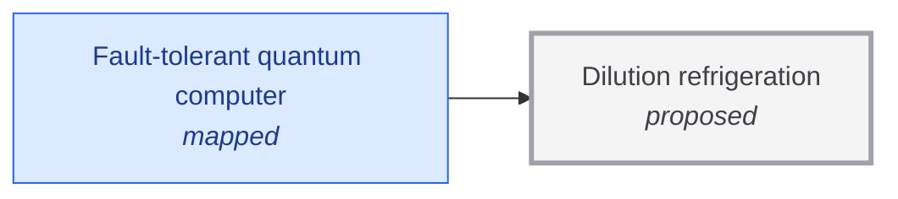

# Dilution refrigeration

<!-- Generated by tools/generate.py from atlas/enablers/dilution-refrigeration.toml. Do not edit by hand. -->

> Cryostats that cool devices to a few millikelvin and remove the heat that wiring, amplifiers and control electronics add at that temperature.

| | |
|---|---|
| Domain | [Enabling technologies](README.md) |
| Atlas status | **proposed**: Named, with a statement and a scope; nothing mapped yet |
| Readiness | not assessed |
| Serves | UN SDG 9 Industry, innovation and infrastructure |
| Curators | none yet; see [how to become one](../../GOVERNANCE.md#curators) |
| Last reviewed | 2026-10-04 |

## Scope

In scope: dilution refrigerators and their cooling power at the stages where qubits and cold electronics sit. Out of scope: the control electronics themselves (enablers/cryogenic-control-electronics) and cooling at room temperature (enablers/heat-removal).

## Metrics

| Metric | Current | Target | Physical limit | Gap to target | Target to limit |
|---|---|---|---|---|---|
| **Cooling power** (headline) | 0.002 W (2025-01-01, [guan2025development](../../evidence/guan2025development.toml)) | – | – | – | – |

- **Cooling power**: measured as: Cryogen-free dilution refrigerator with four parallel dilution units, at 102.48 mK; the power at the 10-20 mK qubit stage is far lower.; current: as_of is the start of the publication year; the abstract gives no date..

## Dependencies

### Required by

| Technology | Why | What it needs from this one |
|---|---|---|
| [Fault-tolerant quantum computer](../../atlas/quantum/fault-tolerant-quantum-computer.md) | Superconducting qubits operate at about 10 mK, and every control line and amplifier adds heat to that stage. | Cooling power; Enough cooling power, in one cryostat or several linked, for the heat load of up to a million physical qubits and their wiring. |

## Evidence

| Card | Source | Class | Checked |
|---|---|---|---|
| [guan2025development](../../evidence/guan2025development.toml) | Guan et al. (2025), [Development of a cryogen-free dilution refrigerator with a cooling power of 2000 μ W at around 100 mK](https://doi.org/10.1063/5.0294894), Review of Scientific Instruments | established | machine-checked |

## Search terms

Where the `scout-literature` skill starts: `dilution refrigerator cooling power`; `cryogen-free dilution refrigerator`; `millikelvin platform large-scale quantum computing`.
