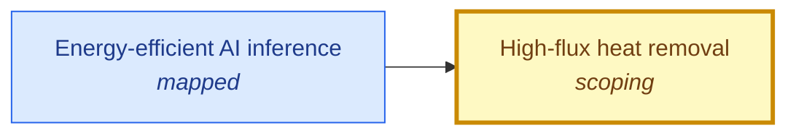

# High-flux heat removal

<!-- Generated by tools/generate.py from atlas/enablers/heat-removal.toml. Do not edit by hand. -->

> Cooling that removes the heat of dense chips and stacked dies at the device, at heat fluxes well above those of air and cold-plate cooling, in a form that fits in a package and can be made in volume.

| | |
|---|---|
| Domain | [Enabling technologies](README.md) |
| Atlas status | **scoping**: Dependencies and the headline metric are mapped; the current value has a source |
| Readiness | TRL 4 (4 of 9) ([wei2026microfluidic](../../evidence/wei2026microfluidic.toml), [barcohen2019embedded](../../evidence/barcohen2019embedded.toml)) |
| Readiness note | Embedded cooling is shown on thermal test vehicles and small GaN-on-diamond devices; a review warns that records are not transferable to package-compatible, large-area, deployed platforms. |
| Horizon | 2030s |
| Serves | UN SDG 9 Industry, innovation and infrastructure |
| Curators | none yet; see [how to become one](../../GOVERNANCE.md#curators) |
| Last reviewed | 2026-10-04 |
| In The Alan Machine | [Building Alan: heat removal](https://the-alan-machine.github.io/alan-machine/building-alan/heat-removal/index.html) |

## Scope

In scope: embedded and near-junction cooling (microfluidic channels, manifolds, jets, two-phase flow, diamond spreaders), measured by heat flux removed at a stated temperature rise. Out of scope: the data-center plant and heat rejection; low-temperature refrigeration, covered by enablers/dilution-refrigeration.

## Metrics

| Metric | Current | Target | Physical limit | Gap to target | Target to limit |
|---|---|---|---|---|---|
| **Heat flux removed** (headline) | 10⁷ W m^-2 (2026-01-01, [wei2026microfluidic](../../evidence/wei2026microfluidic.toml)) | 10⁸ W m^-2 | – | 1.0 orders of magnitude | – |

- **Heat flux removed**: measured as: Heat flux a cooler removes per unit area of the device surface. Heated area, coolant, temperature rise and pumping cost differ across sources and must be stated.; current: The upper end of the 10^2 to 10^3 W/cm2 range stated by the review, taken as 1e3 W/cm2. as_of is the year of the review; the abstract gives no date.; target: Atlas-set reasoning: 10 kW/cm2 over large package-compatible areas. DARPA's near-junction program reached above 40 kW/cm2 (4e8 W/m2) on small GaN-on-diamond devices, so a quarter of that record on deployable, area-scaled hardware would give stacked logic a tenfold margin over today's microfluidic range. ([barcohen2019embedded](../../evidence/barcohen2019embedded.toml)).

## Dependencies

### Required by

| Technology | Why | What it needs from this one |
|---|---|---|
| [Energy-efficient AI inference](../../atlas/ai/energy-efficient-inference.md) | Delivered power and cooling capacity bound how many accelerators fit in a rack and therefore the tokens produced per site. | – |

## Evidence

| Card | Source | Class | Checked |
|---|---|---|---|
| [wei2026microfluidic](../../evidence/wei2026microfluidic.toml) | Wei et al. (2026), [Microfluidic cooling for high-heat-flux chips: Thermal-path compression, bottleneck migration and near-junction limits](https://doi.org/10.70401/tx.2026.0024), Thermo-X | established | machine-checked |
| [barcohen2019embedded](../../evidence/barcohen2019embedded.toml) | Bar‐Cohen et al. (2019), [Embedded Cooling for Wide Bandgap Power Amplifiers: A Review](https://doi.org/10.1115/1.4043404), Journal of Electronic Packaging | established | machine-checked |

## Search terms

Where the `scout-literature` skill starts: `embedded microfluidic cooling heat flux`; `two-phase manifold microchannel cooling`; `near-junction thermal management diamond`.
