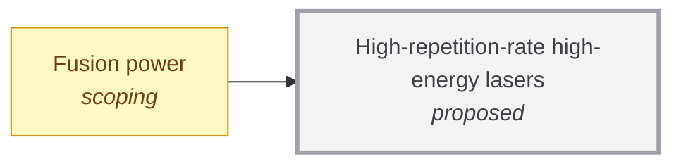

# High-repetition-rate high-energy lasers

<!-- Generated by tools/generate.py from atlas/enablers/high-repetition-rate-lasers.toml. Do not edit by hand. -->

> Lasers of megajoule class that fire several times per second at high wall-plug efficiency and for billions of shots.

| | |
|---|---|
| Domain | [Enabling technologies](README.md) |
| Atlas status | **proposed**: Named, with a statement and a scope; nothing mapped yet |
| Readiness | not assessed |
| Serves | UN SDG 7 Affordable and clean energy, 9 Industry, innovation and infrastructure |
| Curators | none yet; see [how to become one](../../GOVERNANCE.md#curators) |
| Last reviewed | never |

## Scope

In: laser drivers for inertial fusion and the diode-pumped solid-state, gas and fibre approaches to them. Out: continuous-wave industrial lasers and ultrashort-pulse lasers of low energy.

## Dependencies

### Required by

| Technology | Why | What it needs from this one |
|---|---|---|
| [Fusion power](../../atlas/energy/fusion-power.md) | A laser-driven inertial plant needs a driver that fires several times per second, not a few shots per day. | – |

## Search terms

Where the `scout-literature` skill starts: `high repetition rate laser inertial fusion energy driver`; `diode-pumped solid-state laser wall-plug efficiency`; `kilojoule laser Hz`.
