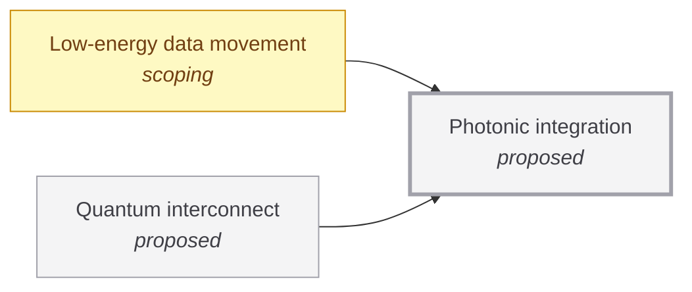

# Photonic integration

<!-- Generated by tools/generate.py from atlas/enablers/photonic-integration.toml. Do not edit by hand. -->

> Many optical components, such as waveguides, modulators, lasers and detectors, made together on one chip with low loss at a cost that allows volume.

| | |
|---|---|
| Domain | [Enabling technologies](README.md) |
| Atlas status | **proposed**: Named, with a statement and a scope; nothing mapped yet |
| Readiness | not assessed |
| Serves | UN SDG 9 Industry, innovation and infrastructure |
| Curators | none yet; see [how to become one](../../CONTRIBUTING.md#curators) |
| Last reviewed | never |

## Scope

In scope: integrated photonic circuits, such as silicon nitride, silicon and III-V platforms, and their loss, integration of sources and detectors, and fabrication. Out of scope: the systems that use them, covered by quantum/quantum-interconnect and computing/low-energy-data-movement.

## Metrics

| Metric | Current | Target | Physical limit | Gap to target | Target to limit |
|---|---|---|---|---|---|
| **Waveguide propagation loss** (headline) | 1.77 dB m^-1 (2024-01-01, [bose2024anneal](../../evidence/bose2024anneal.toml)) | – | – | – | – |

- **Waveguide propagation loss**: measured as: Silicon nitride waveguides with an 80 nm core, made in an anneal-free process at no more than 250 C.; current: as_of is the publication year; the abstract gives no date. No target yet: the loss a quantum interconnect or an optical memory link needs has not been sourced..

## Dependencies

### Required by

| Technology | Why | What it needs from this one |
|---|---|---|
| [Low-energy data movement](../../atlas/computing/low-energy-data-movement.md) | Optical links promise low energy per bit over longer distances than electrical links, and need integrated photonic chips to be made in volume. | – |
| [Quantum interconnect](../../atlas/quantum/quantum-interconnect.md) | Optical links between modules need low-loss waveguides, modulators and detectors integrated on chip. | – |

## Gaps

### Low loss and active devices in one process

severity **medium**; status **active**; type manufacturing; layer manufacturing; blocks Waveguide propagation loss.

Silicon nitride gives the lowest waveguide loss, and integrating III-V and silicon materials has made large-scale nitride circuits with lasers and detectors possible. Ultra-low loss has been reached in an anneal-free process at no more than 250 C, which is compatible with CMOS back-end steps; keeping that loss while lasers, modulators and detectors share the chip, at volume, is the open problem.

Evidence: [bose2024anneal](../../evidence/bose2024anneal.toml), [xiang2022silicon](../../evidence/xiang2022silicon.toml).

## Evidence

| Card | Source | Class | Checked |
|---|---|---|---|
| [bose2024anneal](../../evidence/bose2024anneal.toml) | Bose et al. (2024), [Anneal-free ultra-low loss silicon nitride integrated photonics](https://doi.org/10.1038/s41377-024-01503-4), Light Science & Applications | established | machine-checked |
| [xiang2022silicon](../../evidence/xiang2022silicon.toml) | Xiang et al. (2022), [Silicon nitride passive and active photonic integrated circuits: trends and prospects](https://doi.org/10.1364/prj.452936), Photonics Research | established | machine-checked |

## Search terms

Where the `scout-literature` skill starts: `silicon nitride low-loss waveguide`; `heterogeneous integration III-V silicon photonics`; `photonic integrated circuit`.
