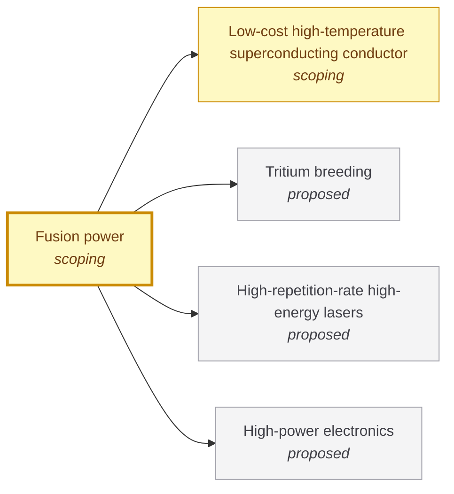

# Fusion power

<!-- Generated by tools/generate.py from atlas/energy/fusion-power.toml. Do not edit by hand. -->

> A power plant that produces net electricity from nuclear fusion, which first needs a fusion fuel target or plasma that releases several times more energy than is delivered to it.

| | |
|---|---|
| Domain | [Energy](README.md) |
| Atlas status | **scoping**: Dependencies and the headline metric are mapped; the current value has a source |
| Readiness | not assessed |
| Horizon | 2040s |
| Serves | UN SDG 7 Affordable and clean energy, 13 Climate action |
| Curators | none yet; see [how to become one](../../GOVERNANCE.md#curators) |
| Last reviewed | 2026-10-04 |

## Scope

In: deuterium-tritium fusion plants, whether by inertial confinement (laser-driven targets) or by magnetic confinement (tokamaks and stellarators). Out: fission and fission-fusion hybrids. The fuel supply is energy/tritium-breeding; the magnets are materials/low-cost-hts-conductor.

## Metrics

| Metric | Current | Target | Physical limit | Gap to target | Target to limit |
|---|---|---|---|---|---|
| **Scientific gain (Q_sci)** (headline) | 1.5 (2022-12-05, [abushawareb2024achievement](../../evidence/abushawareb2024achievement.toml)) | 100 | – | 1.8 orders of magnitude | – |

- **Scientific gain (Q_sci)**: measured as: Indirect-drive inertial confinement, laser energy delivered to the target, scientific breakeven.; target: The high-gain requirement for an inertial fusion energy plant: a ratio of neutron yield to incident laser energy of about 100 (goncharov2025laser), stated independently as gains above 100 needed for a laser-fusion power plant (mcgeoch2025development). Gain must cover the driver's wall-plug efficiency, the thermal-to-electric conversion and the power recirculated to the driver, and still leave most of the output for the grid. ([goncharov2025laser](../../evidence/goncharov2025laser.toml)).

## Dependencies

### Depends on

| Technology | Atlas status | Why | What it must deliver |
|---|---|---|---|
| [Low-cost high-temperature superconducting conductor](../../atlas/materials/low-cost-hts-conductor.md) | scoping | Compact magnetic-confinement designs need fields above 18-20 T, for which high-temperature superconductors are the enabling technology, and their cost and complexity are a large part of the reactor core. | – |
| [Tritium breeding](../../atlas/energy/tritium-breeding.md) | proposed | Deuterium-tritium plants must breed their own tritium; natural supply is negligible. | – |
| [High-repetition-rate high-energy lasers](../../atlas/enablers/high-repetition-rate-lasers.md) | proposed | A laser-driven inertial plant needs a driver that fires several times per second, not a few shots per day. | – |
| [High-power electronics](../../atlas/enablers/power-electronics.md) | proposed | Magnet power supplies, pulsed power and the grid connection of a plant rely on high-power converters. | – |

## Gaps

### Gain of about 100 at power-plant repetition rates

severity **critical**; status **active**; type scientific-unknown; layer principle; blocks Scientific gain (Q_sci).

The record target gain is 1.5, from a single shot at the National Ignition Facility. A plant needs a gain of about 100, which in turn needs a high fraction of the laser energy coupled to the target and the loss mechanisms from laser-plasma instabilities held down. Broadband lasers show promise against those instabilities, and simulations predict gains above 100 with less than 1 MJ of argon fluoride laser energy in direct drive, with no experiment yet at that gain.

Blocked by: [High-repetition-rate high-energy lasers](../../atlas/enablers/high-repetition-rate-lasers.md) (proposed).

| Approach | Readiness | Evidence |
|---|---|---|
| Direct drive with broadband argon fluoride lasers | TRL 2 (2 of 9) | [mcgeoch2025development](../../evidence/mcgeoch2025development.toml) |

Evidence: [abushawareb2024achievement](../../evidence/abushawareb2024achievement.toml), [goncharov2025laser](../../evidence/goncharov2025laser.toml), [mcgeoch2025development](../../evidence/mcgeoch2025development.toml).

## Evidence

| Card | Source | Class | Checked |
|---|---|---|---|
| [abushawareb2024achievement](../../evidence/abushawareb2024achievement.toml) | Abu-Shawareb (2024), [Achievement of Target Gain Larger than Unity in an Inertial Fusion Experiment](https://doi.org/10.1103/PhysRevLett.132.065102), Physical Review Letters | established | machine-checked |
| [goncharov2025laser](../../evidence/goncharov2025laser.toml) | Goncharov (2025), [Laser requirements for inertial fusion energy target designs](https://doi.org/10.1117/12.3041301), Optical Technologies for Inertial Fusion Energy | reported | machine-checked |
| [mcgeoch2025development](../../evidence/mcgeoch2025development.toml) | McGeoch et al. (2025), [Development path to an ArF laser-fusion pilot power plant](https://doi.org/10.1117/12.3047795), Optical Technologies for Inertial Fusion Energy | reported | machine-checked |

## Search terms

Where the `scout-literature` skill starts: `target gain inertial fusion`; `net electricity fusion pilot plant`; `burning plasma fusion energy gain`.
