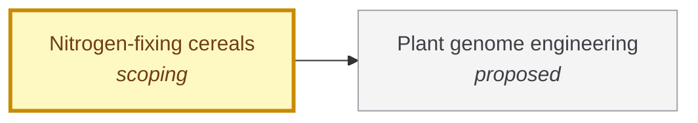

# Nitrogen-fixing cereals

<!-- Generated by tools/generate.py from atlas/food/nitrogen-fixing-cereals.toml. Do not edit by hand. -->

> Cereal crops that obtain most of their nitrogen from the air, through their own nitrogenase, an engineered symbiosis or a partnered microbiome, so that high yields do not depend on synthetic nitrogen fertilizer.

| | |
|---|---|
| Domain | [Food and agriculture](README.md) |
| Atlas status | **scoping**: Dependencies and the headline metric are mapped; the current value has a source |
| Readiness | not assessed |
| Serves | UN SDG 2 Zero hunger, 15 Life on land |
| Curators | none yet; see [how to become one](../../CONTRIBUTING.md#curators) |
| Last reviewed | 2026-10-04 |

## Scope

In: maize, wheat, rice and other cereals that fix nitrogen in the plant or in a stable association with it. Out: fertilizer-applied microbial inoculants that supplement but do not replace fertilizer (they appear here only as an approach), and plant gene-editing tools, which are biotech/plant-genome-engineering.

## Metrics

| Metric | Current | Target | Physical limit | Gap to target | Target to limit |
|---|---|---|---|---|---|
| **Nitrogen from fixation** (headline) | 82% (2018-01-01, [vandeynze2018nitrogen](../../evidence/vandeynze2018nitrogen.toml)) | 100% | – | 18 points | – |

- **Nitrogen from fixation**: measured as: Share of the crop's nitrogen from biological fixation of atmospheric nitrogen, measured with 15N methods.; current: Upper end of a 29-82% range, in an indigenous landrace grown in nitrogen-depleted soil. Not a modern high-yield cultivar: no elite cereal has shown this.; target: A crop that fully meets its nitrogen from the air is the 'N-self-fertilizing' crop described in the literature as capable of autonomous fixation, avoiding the need for chemical fertilizers. The target applies to elite cultivars at full yield, which is what the current value does not show. ([guo2022biological](../../evidence/guo2022biological.toml)).

## Dependencies

### Depends on

| Technology | Atlas status | Why | What it must deliver |
|---|---|---|---|
| [Plant genome engineering](../../atlas/biotech/plant-genome-engineering.md) | proposed | Every route to a self-fertilizing cereal needs many coordinated edits to the plant genome. | – |

## Gaps

### A working nitrogenase inside plant cells

severity **critical**; status **active**; type engineering; layer device; blocks Nitrogen from fixation.

Expressing the nitrogenase components in plant mitochondria is the route to a crop that fixes its own nitrogen. Sixteen nitrogenase proteins have each been expressed and targeted to the mitochondrial matrix of a model plant, but the NifD component is the least abundant and a full working complex in a plant has not been shown.

Blocked by: [Plant genome engineering](../../atlas/biotech/plant-genome-engineering.md) (proposed).

| Approach | Readiness | Evidence |
|---|---|---|
| Fusion of NifD and NifK to equalize their abundance in plant mitochondria | not assessed | [allen2017expression](../../evidence/allen2017expression.toml) |

Evidence: [allen2017expression](../../evidence/allen2017expression.toml), [guo2022biological](../../evidence/guo2022biological.toml).

### Fixation shown in a landrace, not in high-yield cultivars

severity **critical**; status **active**; type scientific-unknown; layer system; blocks Nitrogen from fixation.

The high fixation share was measured in a landrace with aerial roots that secrete mucilage, grown in nitrogen-depleted soil. Moving the trait into elite cultivars at full yield, and under fertilization, has not been shown. Engineered root-associated bacteria that keep fixing in fertilized fields have been commercialized, but their abstract reports a yield gain over fertilizer alone, not a share of nitrogen from fixation.

| Approach | Readiness | Evidence |
|---|---|---|
| Engineered root-associated diazotroph that fixes nitrogen despite fertilizer | not assessed | [wen2021enabling](../../evidence/wen2021enabling.toml) |

Evidence: [vandeynze2018nitrogen](../../evidence/vandeynze2018nitrogen.toml), [wen2021enabling](../../evidence/wen2021enabling.toml).

### Root-nodule symbiosis not yet engineered into non-legumes

severity **high**; status **open**; type scientific-unknown; layer physics; blocks Nitrogen from fixation.

Legumes host nitrogen-fixing rhizobia in root nodules. The objective of engineering nodulation in non-leguminous crops has not been achieved; the open questions are the signalling, infection and nodule-organogenesis programs.

Blocked by: [Plant genome engineering](../../atlas/biotech/plant-genome-engineering.md) (proposed).

Evidence: [huisman2019roadmap](../../evidence/huisman2019roadmap.toml), [guo2022biological](../../evidence/guo2022biological.toml).

## Evidence

| Card | Source | Class | Checked |
|---|---|---|---|
| [vandeynze2018nitrogen](../../evidence/vandeynze2018nitrogen.toml) | Van Deynze et al. (2018), [Nitrogen fixation in a landrace of maize is supported by a mucilage-associated diazotrophic microbiota](https://doi.org/10.1371/journal.pbio.2006352), PLoS Biology | established | machine-checked |
| [guo2022biological](../../evidence/guo2022biological.toml) | Guo et al. (2022), [Biological nitrogen fixation in cereal crops: Progress, strategies, and perspectives](https://doi.org/10.1016/j.xplc.2022.100499), Plant Communications | established | machine-checked |
| [wen2021enabling](../../evidence/wen2021enabling.toml) | Wen et al. (2021), [Enabling Biological Nitrogen Fixation for Cereal Crops in Fertilized Fields](https://doi.org/10.1021/acssynbio.1c00049), ACS Synthetic Biology | established | machine-checked |
| [allen2017expression](../../evidence/allen2017expression.toml) | Allen et al. (2017), [Expression of 16 Nitrogenase Proteins within the Plant Mitochondrial Matrix](https://doi.org/10.3389/fpls.2017.00287), Frontiers in Plant Science | established | machine-checked |
| [huisman2019roadmap](../../evidence/huisman2019roadmap.toml) | Huisman et al. (2019), [A Roadmap toward Engineered Nitrogen-Fixing Nodule Symbiosis](https://doi.org/10.1016/j.xplc.2019.100019), Plant Communications | established | machine-checked |

## Search terms

Where the `scout-literature` skill starts: `nitrogen fixation in cereals`; `engineering nitrogenase in plants`; `engineered nitrogen-fixing symbiosis non-legumes`.
