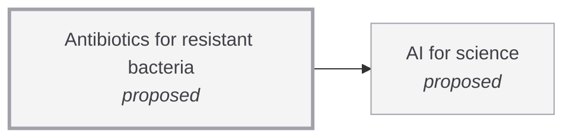

# Antibiotics for resistant bacteria

<!-- Generated by tools/generate.py from atlas/health/antibiotics-for-resistant-bacteria.toml. Do not edit by hand. -->

> New antibiotics, or other agents, that kill bacteria resistant to the drugs now in use, discovered and developed fast enough to keep pace with the spread of resistance. This entry maps research; it is not medical advice.

| | |
|---|---|
| Domain | [Health and medicine](README.md) |
| Atlas status | **proposed**: Named, with a statement and a scope; nothing mapped yet |
| Readiness | not assessed |
| Serves | UN SDG 3 Good health and well-being |
| Curators | none yet; see [how to become one](../../CONTRIBUTING.md#curators) |
| Last reviewed | never |

## Scope

In: small-molecule and peptide antibacterial discovery, including computational discovery, and agents against drug-resistant bacterial infections. Out: vaccines, bacteriophage therapy, and diagnostics. Computational discovery tools belong to ai/ai-for-science.

## Dependencies

### Depends on

| Technology | Atlas status | Why | What it must deliver |
|---|---|---|---|
| [AI for science](../../atlas/ai/ai-for-science.md) | proposed | Machine-learning models screen and generate candidate molecules far faster than screening libraries by hand. | – |

## Search terms

Where the `scout-literature` skill starts: `antibiotic discovery machine learning`; `multidrug-resistant bacteria new antibiotic class`; `antimicrobial resistance pipeline`.
