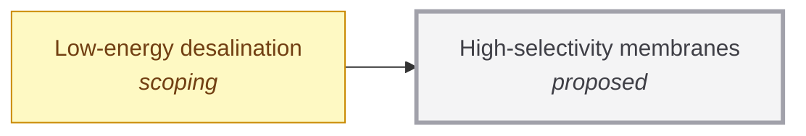

# High-selectivity membranes

<!-- Generated by tools/generate.py from atlas/materials/high-selectivity-membranes.toml. Do not edit by hand. -->

> Membranes that separate salt from water or one gas from another with both high permeability and high selectivity, so that separation needs energy close to the thermodynamic minimum.

| | |
|---|---|
| Domain | [Materials and manufacturing](README.md) |
| Atlas status | **proposed**: Named, with a statement and a scope; nothing mapped yet |
| Readiness | not assessed |
| Serves | UN SDG 6 Clean water and sanitation, 13 Climate action |
| Curators | none yet; see [how to become one](../../CONTRIBUTING.md#curators) |
| Last reviewed | never |

## Scope

In: polymer, ceramic and two-dimensional-material membranes for desalination and gas separation. Out: thermal separation processes, and sorbents (materials/low-cost-co2-sorbents).

## Dependencies

### Required by

| Technology | Why | What it needs from this one |
|---|---|---|
| [Low-energy desalination](../../atlas/water/low-energy-desalination.md) | Membrane permeability and selectivity set how close staged desalination can get to the thermodynamic minimum. | – |

## Search terms

Where the `scout-literature` skill starts: `membrane selectivity permeability trade-off`; `desalination membrane salt rejection`; `two-dimensional membrane separation`.
