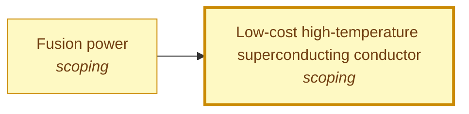

# Low-cost high-temperature superconducting conductor

<!-- Generated by tools/generate.py from atlas/materials/low-cost-hts-conductor.toml. Do not edit by hand. -->

> High-temperature superconducting tape (REBCO) that carries kiloamperes at fusion-magnet conditions at a price per kA-m that lets magnets of hundreds of kilometres of tape be built.

| | |
|---|---|
| Domain | [Materials and manufacturing](README.md) |
| Atlas status | **scoping**: Dependencies and the headline metric are mapped; the current value has a source |
| Readiness | not assessed |
| Serves | UN SDG 7 Affordable and clean energy, 9 Industry, innovation and infrastructure |
| Curators | none yet; see [how to become one](../../GOVERNANCE.md#curators) |
| Last reviewed | 2026-10-04 |

## Scope

In: REBCO coated conductors and their manufacturing cost. Out: low-temperature superconductors such as Nb3Sn and NbTi, and the cabling and magnet engineering built on the tape.

## Metrics

| Metric | Current | Target | Physical limit | Gap to target | Target to limit |
|---|---|---|---|---|---|
| **Conductor cost** (headline) | 100 USD kA^-1 m^-1 (2025-01-01, [zhao2025commercial](../../evidence/zhao2025commercial.toml)) | 20 USD kA^-1 m^-1 | – | 0.7 orders of magnitude | – |

- **Conductor cost**: measured as: REBCO tape at 20 K and 20 T, field parallel to c; derived from price per metre and critical current.; current: Derived from two numbers in the abstract (about 20 USD per metre; critical current above 200 A for a 4 mm tape), so the true value is at or below 100. The date is the year of the paper; no day is given.; target: The cost target for power applications set by a 2026 cost model and roadmap for PLD REBCO tape (fumarulo2026evaluating), which also gives the roadmap of growth rate, REBCO thickness and critical current to get there. ([fumarulo2026evaluating](../../evidence/fumarulo2026evaluating.toml)).

## Dependencies

### Required by

| Technology | Why | What it needs from this one |
|---|---|---|
| [Fusion power](../../atlas/energy/fusion-power.md) | Compact magnetic-confinement designs need fields above 18-20 T, for which high-temperature superconductors are the enabling technology, and their cost and complexity are a large part of the reactor core. | – |

## Evidence

| Card | Source | Class | Checked |
|---|---|---|---|
| [zhao2025commercial](../../evidence/zhao2025commercial.toml) | Zhao (2025), [Commercial compact fusion triggered REBCO tape industry: Pulsed laser deposition technology opportunities and challenges](https://doi.org/10.1016/j.supcon.2025.100188), Superconductivity | established | machine-checked |
| [fumarulo2026evaluating](../../evidence/fumarulo2026evaluating.toml) | Fumarulo et al. (2026), [Evaluating the scalability of REBCO coated-conductor manufacturing by pulsed laser deposition](https://doi.org/10.1088/1361-6668/aea455), Superconductor Science and Technology | established | machine-checked |

## Search terms

Where the `scout-literature` skill starts: `REBCO coated conductor cost`; `HTS tape price per kA-m`; `REBCO manufacturing scale-up`.
