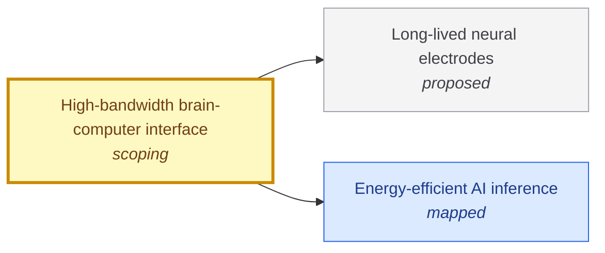

# High-bandwidth brain-computer interface

<!-- Generated by tools/generate.py from atlas/neurotech/high-bandwidth-bci.toml. Do not edit by hand. -->

> An implanted interface that lets a person with paralysis communicate at close to the speed of natural conversation, reliably, from a device that works for years. This entry maps research; it is not medical advice.

| | |
|---|---|
| Domain | [Neurotechnology](README.md) |
| Atlas status | **scoping**: Dependencies and the headline metric are mapped; the current value has a source |
| Readiness | not assessed |
| Serves | UN SDG 3 Good health and well-being, 10 Reduced inequalities |
| Curators | none yet; see [how to become one](../../CONTRIBUTING.md#curators) |
| Last reviewed | 2026-10-04 |

## Scope

In: intracortical and other implanted interfaces that decode attempted speech or movement into text, sound or control. Out: non-invasive interfaces, and neural stimulation therapies. The recording electrodes are covered by neurotech/long-lived-neural-electrodes.

## Metrics

| Metric | Current | Target | Physical limit | Gap to target | Target to limit |
|---|---|---|---|---|---|
| **Communication rate** (headline) | 62 words min^-1 (2023-01-01, [willett2023high](../../evidence/willett2023high.toml)) | 160 words min^-1 | – | 0.4 orders of magnitude | – |

- **Communication rate**: measured as: Speech-to-text decoding of attempted speech, intracortical arrays, one participant with ALS, large vocabulary.; current: as_of is the publication year; a later study in the same field reports about 32 words per minute in self-paced conversation (Card et al., NEJM 2024), so the figure depends on the task. One participant.; target: The speed of natural conversation as stated in the source paper, the rate at which a spoken exchange flows without the user waiting. ([willett2023high](../../evidence/willett2023high.toml)).

## Dependencies

### Depends on

| Technology | Atlas status | Why | What it must deliver |
|---|---|---|---|
| [Long-lived neural electrodes](../../atlas/neurotech/long-lived-neural-electrodes.md) | proposed | Decoding depends on recordings from implanted electrodes that must keep working for years. | – |
| [Energy-efficient AI inference](../../atlas/ai/energy-efficient-inference.md) | mapped | Decoding runs a neural network on the neural signal; running it in a wearable or implanted device needs low energy per inference. | – |

## Gaps

### Decoding rate is well below natural conversation

severity **high**; status **active**; type engineering; layer system; blocks Communication rate.

The 2023 demonstration decoded 62 words per minute, which the authors describe as beginning to approach the speed of natural conversation, 160 words per minute. The result comes from one participant, so how it generalizes across people is not established.

Blocked by: [Long-lived neural electrodes](../../atlas/neurotech/long-lived-neural-electrodes.md) (proposed).

Evidence: [willett2023high](../../evidence/willett2023high.toml).

## Evidence

| Card | Source | Class | Checked |
|---|---|---|---|
| [willett2023high](../../evidence/willett2023high.toml) | Willett et al. (2023), [A high-performance speech neuroprosthesis](https://doi.org/10.1038/s41586-023-06377-x), Nature | established | machine-checked |

## Search terms

Where the `scout-literature` skill starts: `speech neuroprosthesis`; `intracortical brain-computer interface communication`; `attempted speech decoding`.
