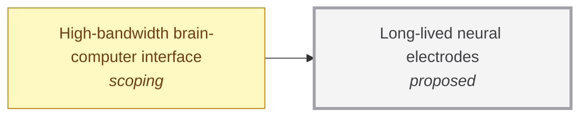

# Long-lived neural electrodes

<!-- Generated by tools/generate.py from atlas/neurotech/long-lived-neural-electrodes.toml. Do not edit by hand. -->

> Implanted electrodes that record the activity of many neurons with stable signal quality for many years, without damaging tissue or being rejected by the body.

| | |
|---|---|
| Domain | [Neurotechnology](README.md) |
| Atlas status | **proposed**: Named, with a statement and a scope; nothing mapped yet |
| Readiness | not assessed |
| Serves | UN SDG 3 Good health and well-being |
| Curators | none yet; see [how to become one](../../CONTRIBUTING.md#curators) |
| Last reviewed | never |

## Scope

In: intracortical electrode arrays and thin-film or flexible probes, and the signal stability and tissue response over time. Out: the decoding software and the interface as a whole (neurotech/high-bandwidth-bci).

## Dependencies

### Required by

| Technology | Why | What it needs from this one |
|---|---|---|
| [High-bandwidth brain-computer interface](../../atlas/neurotech/high-bandwidth-bci.md) | Decoding depends on recordings from implanted electrodes that must keep working for years. | – |

## Search terms

Where the `scout-literature` skill starts: `chronic intracortical electrode signal stability`; `foreign body response neural probe`; `flexible neural electrode long-term recording`.
