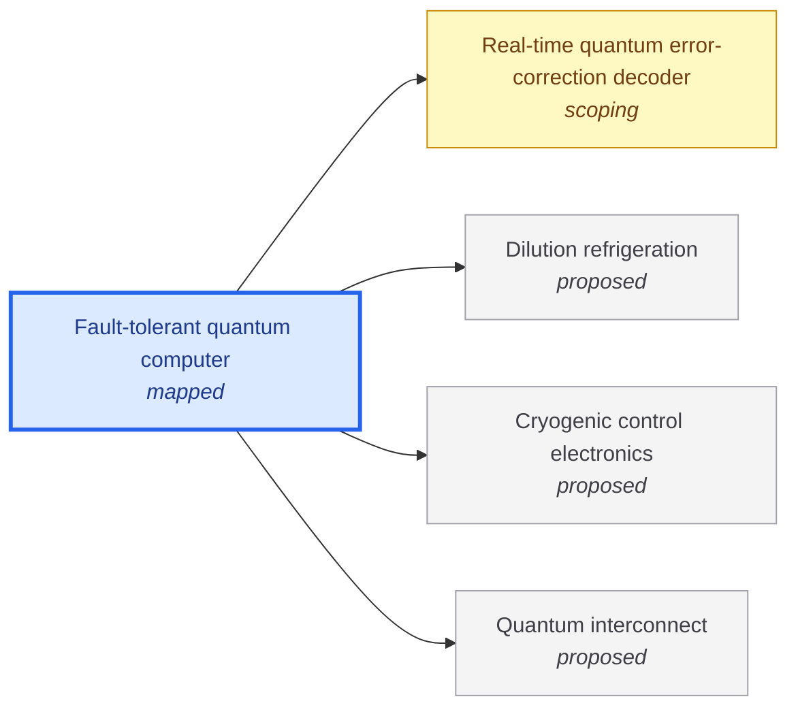

# Fault-tolerant quantum computer

<!-- Generated by tools/generate.py from atlas/quantum/fault-tolerant-quantum-computer.toml. Do not edit by hand. -->

> A quantum computer that runs algorithms of practical value, with logical error rates low enough that the answer can be trusted. It does this by encoding each logical qubit in many noisy physical qubits and correcting errors faster than they accumulate.

| | |
|---|---|
| Domain | [Quantum technologies](README.md) |
| Atlas status | **mapped**: Every metric has a current value with a source and a target; the main gaps are written |
| Readiness | TRL 4 (4 of 9) ([google2024quantum](../../evidence/google2024quantum.toml)) |
| Readiness note | A distance-7 surface-code memory below threshold has been shown in the laboratory; no logical algorithm of practical value has run, and the wiring, refrigeration and decoding for a million-qubit machine are not built. |
| Serves | UN SDG 9 Industry, innovation and infrastructure |
| Curators | none yet; see [how to become one](../../GOVERNANCE.md#curators) |
| Last reviewed | 2026-10-04 |
| In The Alan Machine | [The quantum Alan](https://the-alan-machine.github.io/the-alan-machine/chapters/quantum-alan/index.html), [Building Alan: quantum hardware](https://the-alan-machine.github.io/the-alan-machine/building-alan/quantum-hardware/index.html) |

## Scope

In scope: the full machine that error-corrects a computation, built here from physical qubits, a real-time decoder, cryogenic control and refrigeration, and links between modules. Out of scope: noisy intermediate-scale machines without error correction, quantum sensors and quantum networks for their own sake. The decoder is covered by quantum/real-time-qec-decoder and the module links by quantum/quantum-interconnect.

## Impact

What reaching the target would change, and for whom (decision 0015).

- **Risk**: A quantum computer with less than a million noisy qubits could factor a 2048-bit RSA integer in less than a week, under the estimate's assumptions of a uniform gate error of 0.1%, a surface-code cycle of 1 microsecond and a control reaction time of 10 microseconds. Who: Anyone whose data is protected by RSA-2048. Class reported; unlocked by the target for Physical qubits; serves UN SDG 9 Industry, innovation and infrastructure; evidence [gidney2025how](../../evidence/gidney2025how.toml).

## Metrics

| Metric | Current | Target | Physical limit | Gap to target | Target to limit |
|---|---|---|---|---|---|
| **Logical error per cycle** (headline) | 0.00143 (2024-12-09, [google2024quantum](../../evidence/google2024quantum.toml)) | 10⁻¹² | – | 9.2 orders of magnitude | – |
| Two-qubit gate infidelity | 6 × 10⁻⁴ (2025-01-01, [lin2025days](../../evidence/lin2025days.toml)) | 0.001 | – | met | – |
| Physical qubits | 101 qubit (2024-12-09, [google2024quantum](../../evidence/google2024quantum.toml)) | 10⁶ qubit | – | 4.0 orders of magnitude | – |
| Decoder latency | 6.3 × 10⁻⁵ s (2024-12-09, [google2024quantum](../../evidence/google2024quantum.toml)) | 10⁻⁵ s | – | 0.8 orders of magnitude | – |

- **Logical error per cycle**: measured as: Surface-code memory, distance 7, 101 qubits, superconducting processor.; target: Gidney's RSA-2048 estimate runs for less than a week at a 1 microsecond cycle, about 6e11 cycles (6.05e5 s divided by 1e-6 s; durations from gidney2025how). A single logical qubit must then fail with probability well under 1/(6e11), about 1.7e-12, per cycle; with many logical qubits the requirement is lower still, so 1e-12 is a floor of the order of magnitude, not a precise budget. ([gidney2025how](../../evidence/gidney2025how.toml)).
- **Two-qubit gate infidelity**: measured as: Best reported single pair: 60 ns gate on two fluxonium qubits, randomized benchmarking.; current: as_of is the start of the publication year (PRX Quantum volume 6, 2025); the exact date was not in the abstract. One pair, not a uniform array.; target: Gidney's RSA-2048 estimate assumes a uniform gate error of 0.1% across a square grid of qubits. The best pair already beats it, so the gap is uniformity across a million qubits, not the best pair. ([gidney2025how](../../evidence/gidney2025how.toml)).
- **Physical qubits**: measured as: Qubits used by the distance-7 surface-code memory on the Willow processor.; target: Upper bound of the RSA-2048 resource estimate: less than a million noisy qubits (gidney2025how), down from 20 million in the 2019 estimate. ([gidney2025how](../../evidence/gidney2025how.toml)).
- **Decoder latency**: measured as: Average real-time decoder latency, distance-5 surface code, cycle time 1.1 microseconds.; target: The control-system reaction time of 10 microseconds assumed by the RSA-2048 resource estimate (gidney2025how). ([gidney2025how](../../evidence/gidney2025how.toml)).

## Dependencies

### Depends on

| Technology | Atlas status | Why | What it must deliver |
|---|---|---|---|
| [Real-time quantum error-correction decoder](../../atlas/quantum/real-time-qec-decoder.md) | scoping | Every error-correction cycle needs its syndromes decoded before the next logical operation that depends on them. | Decoder latency: 10⁻⁵ s; Reaction time of 10 microseconds, the figure assumed in the RSA-2048 resource estimate (gidney2025how). |
| [Dilution refrigeration](../../atlas/enablers/dilution-refrigeration.md) | proposed | Superconducting qubits operate at about 10 mK, and every control line and amplifier adds heat to that stage. | Cooling power; Enough cooling power, in one cryostat or several linked, for the heat load of up to a million physical qubits and their wiring. |
| [Cryogenic control electronics](../../atlas/enablers/cryogenic-control-electronics.md) | proposed | One coaxial line per qubit does not scale to a million qubits; control and readout electronics must sit in the cold. | – |
| [Quantum interconnect](../../atlas/quantum/quantum-interconnect.md) | proposed | A machine of up to a million qubits is unlikely to fit in one cryostat, so modules must be linked by quantum channels. | – |

## Gaps

### Qubit count and control wiring

severity **critical**; status **active**; type engineering; layer system; blocks Physical qubits.

The largest error-corrected memory in the evidence uses 101 qubits; the target is up to a million. A coaxial line per qubit from room temperature does not scale, so control and readout must move into the cryostat. Cryo-CMOS multiplexing has worked below 15 mK without degrading relaxation times, and superconducting digital demultiplexing has run a multi-qubit system, both at laboratory scale.

Blocked by: [Cryogenic control electronics](../../atlas/enablers/cryogenic-control-electronics.md) (proposed), [Dilution refrigeration](../../atlas/enablers/dilution-refrigeration.md) (proposed).

| Approach | Readiness | Evidence |
|---|---|---|
| Cryo-CMOS multiplexer below 15 mK | TRL 4 (4 of 9) | [acharya2023multiplexed](../../evidence/acharya2023multiplexed.toml) |
| Superconducting digital control electronics at millikelvin | TRL 4 (4 of 9) | [jordan2026quantum](../../evidence/jordan2026quantum.toml) |

Evidence: [acharya2023multiplexed](../../evidence/acharya2023multiplexed.toml), [jordan2026quantum](../../evidence/jordan2026quantum.toml), [krinner2019engineering](../../evidence/krinner2019engineering.toml), [pauka2019cryogenic](../../evidence/pauka2019cryogenic.toml).

### Correlated errors from cosmic rays and radioactivity

severity **high**; status **promising**; type scientific-unknown; layer device; blocks Logical error per cycle.

Muons and gamma rays create quasiparticle bursts that cause correlated errors across a chip, which error correction cannot absorb. A measurement on a 63-qubit processor separated the contributions of muons and gamma rays. Back-side phonon downconversion cut correlated poisoning by two orders of magnitude on three-qubit chips; it has not been shown on a million-qubit array.

| Approach | Readiness | Evidence |
|---|---|---|
| Phonon downconversion with back-side normal-metal reservoirs | TRL 4 (4 of 9) | [iaia2022phonon](../../evidence/iaia2022phonon.toml) |

Evidence: [li2025cosmic](../../evidence/li2025cosmic.toml), [iaia2022phonon](../../evidence/iaia2022phonon.toml).

### Decoding at scale and in real time

severity **high**; status **active**; type engineering; layer system; blocks Decoder latency.

The Willow decoder averaged 63 microseconds at distance 5, six times the 10 microsecond reaction time assumed in the RSA-2048 estimate, and at a cycle time of 1.1 microseconds, far from 1 microsecond at thousands of logical qubits. FPGA decoders report tens to hundreds of nanoseconds per measurement round in modeled-noise studies, which is not the same quantity as end-to-end latency in a running experiment.

Blocked by: [Real-time quantum error-correction decoder](../../atlas/quantum/real-time-qec-decoder.md) (scoping).

| Approach | Readiness | Evidence |
|---|---|---|
| Distributed Union-Find decoder on FPGA | TRL 3 (3 of 9) | [liyanage2024fpga](../../evidence/liyanage2024fpga.toml) |

Evidence: [google2024quantum](../../evidence/google2024quantum.toml), [liyanage2024fpga](../../evidence/liyanage2024fpga.toml), [gidney2025how](../../evidence/gidney2025how.toml).

### Links between modules

severity **high**; status **open**; type engineering; layer system; blocks Logical error per cycle.

A multinode machine needs entanglement between cryostats. Internode gates may be two to three orders of magnitude noisier and slower than local operations, and a systems analysis finds link performance must improve by 10 to 100 times.

Blocked by: [Quantum interconnect](../../atlas/quantum/quantum-interconnect.md) (proposed).

| Approach | Readiness | Evidence |
|---|---|---|
| Optical interconnects with entanglement distillation | TRL 2 (2 of 9) | [ang2024arquin](../../evidence/ang2024arquin.toml) |

Evidence: [ang2024arquin](../../evidence/ang2024arquin.toml).

### Physical error rates uniform across the array

severity **high**; status **active**; type engineering; layer device; blocks Logical error per cycle.

Single pairs of superconducting qubits reach two-qubit gate fidelity of 99.94% (error 6e-4) with stability over 24 days, but a million-qubit machine needs every pair near that level at once, with leakage and crosstalk held down. The Willow memory ran at 0.143% logical error per cycle at distance 7, short of the target by about nine orders of magnitude. Closing it means both lower physical error and larger code distance on many more qubits.

| Approach | Readiness | Evidence |
|---|---|---|
| Fluxonium qubits with direct two-qubit gates | TRL 3 (3 of 9) | [lin2025days](../../evidence/lin2025days.toml) |

Evidence: [google2024quantum](../../evidence/google2024quantum.toml), [lin2025days](../../evidence/lin2025days.toml).

### Refrigeration for the heat load

severity **high**; status **open**; type engineering; layer system; blocks Physical qubits.

Each wired qubit adds passive heat load from cables and active load from signal dissipation. The strongest dilution refrigerator in the evidence delivers 2 mW at about 100 mK with a base temperature of 6.6 mK; no source in the atlas states the load of a million-qubit machine. Resource models of modular machines predict power and thermal load, and point to splitting the machine across cryostats.

Blocked by: [Dilution refrigeration](../../atlas/enablers/dilution-refrigeration.md) (proposed).

| Approach | Readiness | Evidence |
|---|---|---|
| Modular machine split across several cryostats | TRL 2 (2 of 9) | [saadatmand2026superconducting](../../evidence/saadatmand2026superconducting.toml) |

Evidence: [guan2025development](../../evidence/guan2025development.toml), [krinner2019engineering](../../evidence/krinner2019engineering.toml), [saadatmand2026superconducting](../../evidence/saadatmand2026superconducting.toml).

## Evidence

| Card | Source | Class | Checked |
|---|---|---|---|
| [google2024quantum](../../evidence/google2024quantum.toml) | Google Quantum AI and Collaborators (2024), [Quantum error correction below the surface code threshold](https://doi.org/10.1038/s41586-024-08449-y), Nature | established | machine-checked |
| [gidney2025how](../../evidence/gidney2025how.toml) | Gidney (2025), [How to factor 2048 bit RSA integers with less than a million noisy qubits](https://arxiv.org/abs/2505.15917), arXiv | reported | machine-checked |
| [lin2025days](../../evidence/lin2025days.toml) | Lin et al. (2025), [24 Days-Stable CNOT Gate on Fluxonium Qubits with Over 99.9% Fidelity](https://doi.org/10.1103/prxquantum.6.010349), PRX Quantum | established | machine-checked |
| [acharya2023multiplexed](../../evidence/acharya2023multiplexed.toml) | Acharya et al. (2023), [Multiplexed superconducting qubit control at millikelvin temperatures with a low-power cryo-CMOS multiplexer](https://doi.org/10.1038/s41928-023-01033-8), Nature Electronics | established | machine-checked |
| [jordan2026quantum](../../evidence/jordan2026quantum.toml) | Jordan et al. (2026), [A quantum computer controlled by superconducting digital electronics at millikelvin temperature](https://doi.org/10.1038/s41928-026-01576-6), Nature Electronics | established | machine-checked |
| [krinner2019engineering](../../evidence/krinner2019engineering.toml) | Krinner et al. (2019), [Engineering cryogenic setups for 100-qubit scale superconducting circuit systems](https://doi.org/10.1140/epjqt/s40507-019-0072-0), EPJ Quantum Technology | established | machine-checked |
| [pauka2019cryogenic](../../evidence/pauka2019cryogenic.toml) | Pauka et al. (2019), [A Cryogenic Interface for Controlling Many Qubits](https://arxiv.org/abs/1912.01299), arXiv | reported | machine-checked |
| [li2025cosmic](../../evidence/li2025cosmic.toml) | Li et al. (2025), [Cosmic-ray-induced correlated errors in superconducting qubit array](https://doi.org/10.1038/s41467-025-59778-z), Nature Communications | established | machine-checked |
| [iaia2022phonon](../../evidence/iaia2022phonon.toml) | Iaia et al. (2022), [Phonon downconversion to suppress correlated errors in superconducting qubits](https://doi.org/10.1038/s41467-022-33997-0), Nature Communications | established | machine-checked |
| [liyanage2024fpga](../../evidence/liyanage2024fpga.toml) | Liyanage et al. (2024), [FPGA-Based Distributed Union-Find Decoder for Surface Codes](https://doi.org/10.1109/tqe.2024.3467271), IEEE Transactions on Quantum Engineering | established | machine-checked |
| [guan2025development](../../evidence/guan2025development.toml) | Guan et al. (2025), [Development of a cryogen-free dilution refrigerator with a cooling power of 2000 μ W at around 100 mK](https://doi.org/10.1063/5.0294894), Review of Scientific Instruments | established | machine-checked |
| [saadatmand2026superconducting](../../evidence/saadatmand2026superconducting.toml) | Saadatmand (2026), [Superconducting qubits in the millions: The potential and limitations of modularity](https://doi.org/10.1103/k3d5-v43c), Physical Review Applied | extrapolation | machine-checked |
| [ang2024arquin](../../evidence/ang2024arquin.toml) | Ang et al. (2024), [ARQUIN: Architectures for Multinode Superconducting Quantum Computers](https://doi.org/10.1145/3674151), ACM Transactions on Quantum Computing | extrapolation | machine-checked |

## Search terms

Where the `scout-literature` skill starts: `quantum error correction below threshold`; `logical qubit surface code`; `fault-tolerant quantum computing resource estimate`.
