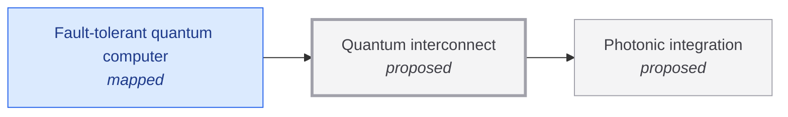

# Quantum interconnect

<!-- Generated by tools/generate.py from atlas/quantum/quantum-interconnect.toml. Do not edit by hand. -->

> Channels that carry quantum states or entanglement between quantum processors in separate cryostats or modules, so that a machine can grow past what one cryostat holds.

| | |
|---|---|
| Domain | [Quantum technologies](README.md) |
| Atlas status | **proposed**: Named, with a statement and a scope; nothing mapped yet |
| Readiness | not assessed |
| Serves | UN SDG 9 Industry, innovation and infrastructure |
| Curators | none yet; see [how to become one](../../GOVERNANCE.md#curators) |
| Last reviewed | never |

## Scope

In scope: links between modules of a superconducting machine, such as microwave-to-optical transduction and optical entanglement distribution, and their fidelity and rate. Out of scope: long-distance quantum networks and communication for their own sake, and on-chip couplers inside a module.

## Dependencies

### Depends on

| Technology | Atlas status | Why | What it must deliver |
|---|---|---|---|
| [Photonic integration](../../atlas/enablers/photonic-integration.md) | proposed | Optical links between modules need low-loss waveguides, modulators and detectors integrated on chip. | – |

### Required by

| Technology | Why | What it needs from this one |
|---|---|---|
| [Fault-tolerant quantum computer](../../atlas/quantum/fault-tolerant-quantum-computer.md) | A machine of up to a million qubits is unlikely to fit in one cryostat, so modules must be linked by quantum channels. | – |

## Search terms

Where the `scout-literature` skill starts: `quantum interconnect modular quantum computer`; `microwave-to-optical transduction`; `entanglement distribution between cryostats`.
