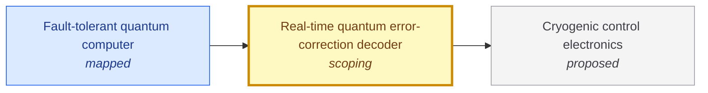

# Real-time quantum error-correction decoder

<!-- Generated by tools/generate.py from atlas/quantum/real-time-qec-decoder.toml. Do not edit by hand. -->

> Classical hardware and algorithms that turn the stream of syndrome measurements of an error-correcting code into corrections, fast enough that the quantum computer never waits for them.

| | |
|---|---|
| Domain | [Quantum technologies](README.md) |
| Atlas status | **scoping**: Dependencies and the headline metric are mapped; the current value has a source |
| Readiness | not assessed |
| Serves | UN SDG 9 Industry, innovation and infrastructure |
| Curators | none yet; see [how to become one](../../CONTRIBUTING.md#curators) |
| Last reviewed | 2026-10-04 |

## Scope

In scope: the decoding algorithm, its implementation on FPGA or ASIC, and its latency and throughput during a live experiment. Out of scope: the choice of code, the qubits themselves (quantum/fault-tolerant-quantum-computer) and the cryogenic electronics it may sit on (enablers/cryogenic-control-electronics).

## Metrics

| Metric | Current | Target | Physical limit | Gap to target | Target to limit |
|---|---|---|---|---|---|
| **Decoder latency** (headline) | 6.3 × 10⁻⁵ s (2024-12-09, [google2024quantum](../../evidence/google2024quantum.toml)) | 10⁻⁵ s | – | 0.8 orders of magnitude | – |

- **Decoder latency**: measured as: Average real-time decoder latency in a running experiment: distance-5 surface code, cycle time 1.1 microseconds.; current: Other decoder studies report times per measurement round under modeled noise (liyanage2024fpga); these are not end-to-end latencies in an experiment and are not used as current values.; target: The control-system reaction time of 10 microseconds assumed by the RSA-2048 resource estimate (gidney2025how). ([gidney2025how](../../evidence/gidney2025how.toml)).

## Dependencies

### Depends on

| Technology | Atlas status | Why | What it must deliver |
|---|---|---|---|
| [Cryogenic control electronics](../../atlas/enablers/cryogenic-control-electronics.md) | proposed | The decoder reads syndromes from the control system, and placing it near the qubits shortens the path and the latency. | – |

### Required by

| Technology | Why | What it needs from this one |
|---|---|---|
| [Fault-tolerant quantum computer](../../atlas/quantum/fault-tolerant-quantum-computer.md) | Every error-correction cycle needs its syndromes decoded before the next logical operation that depends on them. | Decoder latency: 10⁻⁵ s; Reaction time of 10 microseconds, the figure assumed in the RSA-2048 resource estimate (gidney2025how). |

## Evidence

| Card | Source | Class | Checked |
|---|---|---|---|
| [google2024quantum](../../evidence/google2024quantum.toml) | Google Quantum AI and Collaborators (2024), [Quantum error correction below the surface code threshold](https://doi.org/10.1038/s41586-024-08449-y), Nature | established | machine-checked |
| [gidney2025how](../../evidence/gidney2025how.toml) | Gidney (2025), [How to factor 2048 bit RSA integers with less than a million noisy qubits](https://arxiv.org/abs/2505.15917), arXiv | reported | machine-checked |

## Search terms

Where the `scout-literature` skill starts: `real-time decoder surface code`; `FPGA decoder quantum error correction`; `decoder latency`.
