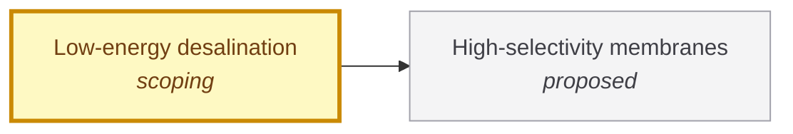

# Low-energy desalination

<!-- Generated by tools/generate.py from atlas/water/low-energy-desalination.toml. Do not edit by hand. -->

> Turning seawater into fresh water using electricity close to the thermodynamic minimum for the separation, so that desalination is no longer limited by its energy bill.

| | |
|---|---|
| Domain | [Water](README.md) |
| Atlas status | **scoping**: Dependencies and the headline metric are mapped; the current value has a source |
| Readiness | not assessed |
| Serves | UN SDG 6 Clean water and sanitation |
| Curators | none yet; see [how to become one](../../GOVERNANCE.md#curators) |
| Last reviewed | 2026-10-04 |

## Scope

In: seawater desalination by membranes (reverse osmosis, electrodialysis) and the energy recovery and staging around them. Out: the membranes themselves, which are materials/high-selectivity-membranes; brackish and wastewater reuse, which start from much lower salinity and need less energy; and the power source, which belongs to the energy domain.

## Metrics

| Metric | Current | Target | Physical limit | Gap to target | Target to limit |
|---|---|---|---|---|---|
| **Specific energy consumption** (headline) | 3 kWh m^-3 (2021-01-01, [doornbusch2021multistage](../../evidence/doornbusch2021multistage.toml)) | 1 kWh m^-3 | – | 0.5 orders of magnitude | – |

- **Specific energy consumption**: measured as: Seawater feed, electricity per cubic metre of fresh water.; current: Best value found in a measurement with natural seawater in this seed pass: multistage electrodialysis, not reverse osmosis. The abstract-level search did not find a measured full-scale reverse osmosis figure with a quotable number, so the true state of the art may be lower; a curator should replace this value with a full-scale reverse osmosis measurement.; target: A round value chosen by the atlas, not set by an agency: about the level a simulation study reached for reverse osmosis on osmotically diluted seawater (0.96 kWh/m3), and a third of the current value, so that energy stops dominating the cost of desalinated water. ([yalamanchili2024can](../../evidence/yalamanchili2024can.toml)).

## Dependencies

### Depends on

| Technology | Atlas status | Why | What it must deliver |
|---|---|---|---|
| [High-selectivity membranes](../../atlas/materials/high-selectivity-membranes.md) | proposed | Membrane permeability and selectivity set how close staged desalination can get to the thermodynamic minimum. | – |

## Gaps

### Membrane permeability and selectivity trade off

severity **high**; status **active**; type engineering; layer device; blocks Specific energy consumption.

Reverse osmosis membranes trade water permeability against salt rejection. Analysis of biomimetic membranes indicates what a more permeable, defect-free membrane could offer for seawater desalination, but such membranes are not yet a commercial product.

Blocked by: [High-selectivity membranes](../../atlas/materials/high-selectivity-membranes.md) (proposed).

Evidence: [werber2018permselectivity](../../evidence/werber2018permselectivity.toml), [elimelech2011future](../../evidence/elimelech2011future.toml).

### Practical plants already work near the thermodynamic limit

severity **high**; status **open**; type fundamental-limit; layer physics; blocks Specific energy consumption.

Reversible reverse osmosis and electrodialysis consume the Gibbs free energy of separation, and the practical energy of both approaches that minimum only as the number of stages grows. Reviews state that most desalination technologies already work near their limit, so the remaining reduction is bounded and each step costs capital. The numeric value of the minimum is in the body of the cited papers and is not recorded here yet.

Evidence: [wang2020derivation](../../evidence/wang2020derivation.toml), [elimelech2011future](../../evidence/elimelech2011future.toml), [nassrullah2020energy](../../evidence/nassrullah2020energy.toml).

## Evidence

| Card | Source | Class | Checked |
|---|---|---|---|
| [doornbusch2021multistage](../../evidence/doornbusch2021multistage.toml) | Doornbusch et al. (2021), [Multistage electrodialysis for desalination of natural seawater](https://doi.org/10.1016/j.desal.2021.114973), Desalination | established | machine-checked |
| [yalamanchili2024can](../../evidence/yalamanchili2024can.toml) | Yalamanchili et al. (2024), [Can a forward osmosis-reverse osmosis hybrid system achieve 90 % wastewater recovery and desalination energy below 1 kWh/m3? A design and simulation study](https://doi.org/10.1016/j.desal.2024.117767), Desalination | extrapolation | machine-checked |
| [wang2020derivation](../../evidence/wang2020derivation.toml) | Wang et al. (2020), [Derivation of the Theoretical Minimum Energy of Separation of Desalination Processes](https://doi.org/10.1021/acs.jchemed.0c01194), Journal of Chemical Education | established | machine-checked |
| [elimelech2011future](../../evidence/elimelech2011future.toml) | Elimelech et al. (2011), [The Future of Seawater Desalination: Energy, Technology, and the Environment](https://doi.org/10.1126/science.1200488), Science | established | machine-checked |
| [nassrullah2020energy](../../evidence/nassrullah2020energy.toml) | Nassrullah et al. (2020), [Energy for desalination: A state-of-the-art review](https://doi.org/10.1016/j.desal.2020.114569), Desalination | established | machine-checked |
| [werber2018permselectivity](../../evidence/werber2018permselectivity.toml) | Werber et al. (2018), [Permselectivity limits of biomimetic desalination membranes](https://doi.org/10.1126/sciadv.aar8266), Science Advances | established | machine-checked |

## Search terms

Where the `scout-literature` skill starts: `seawater reverse osmosis specific energy consumption`; `thermodynamic minimum energy of desalination`; `multistage electrodialysis seawater`.
