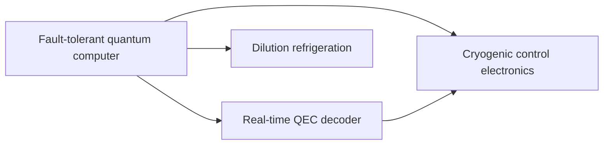

# The model

How the atlas is built, in one page. The decisions behind each part are in
[docs/decisions/](decisions/README.md); every field is commented in
[templates/technology.toml](../templates/technology.toml) and
[templates/evidence.toml](../templates/evidence.toml).

## Technologies form a graph

A **technology** is a capability with a measurable target: "a fault-tolerant quantum computer",
"direct air capture at 100 USD per tonne". Each one is a file, `atlas/<domain>/<slug>.toml`, and its
id is `<domain>/<slug>`.

A technology lists what it depends on in `[[requires]]`. Each dependency is itself a technology,
with its own file, metrics and gaps. So the atlas is a directed graph without cycles:



Reading the graph both ways answers two questions. Down: what must this technology wait for?
Up ("Required by" on each page): who is waiting for this one, and what do they need from it?
The technologies many others wait on, across domains, are the bottlenecks; `STATUS.md` lists them.

## What a technology holds

| Part | What it says |
|---|---|
| `statement`, `scope` | What exists when the technology is done; what is in and out |
| `status` | How far the atlas has mapped it: proposed, scoping, mapped, tracked, achieved, retired |
| `readiness` | How far the technology itself has come, on a scale (TRL, MRL, clinical phases), with evidence |
| `[[metric]]` | The numbers that measure progress: current, target, limit |
| `[[gap]]` | What stands between the current value and the target |
| `[[requires]]` | The technologies it depends on, and what it needs from each |
| `[[impact]]` | What reaching the target would change, and for whom: a benefit or a risk, with its evidence |
| `search_terms` | Where the literature scout starts |
| `alan_machine` | Pages of The Alan Machine that discuss it |

## Three numbers per metric

```
current ──── gap to target ────► target ──── headroom ────► physical limit
(best shown, dated, sourced)     (why this value)            (which law)
```

Gaps are in orders of magnitude for metrics that span many (energy per operation, launch cost) and
in points or units for bounded ones (sensitivity, share of nitrogen). A target beyond the physical
limit is itself a gap, of status `beyond-limit`: the target has to change.

## Gaps

Each gap has a **type** (scientific-unknown, engineering, fundamental-limit, data, manufacturing,
cost, regulation, supply-chain), a **layer** (principle, device, system, manufacturing, deployment),
a **severity** and a **status** (open, active, promising, closed, beyond-limit). A gap is closed only
by an established evidence card. A gap held open by a dependency says `blocked_by` that dependency.
Approaches are the lines of research aimed at the gap, each with its evidence and readiness.

## Impact

Each `[[impact]]` says what reaching the target would change: its **kind** (benefit or risk),
**who** gains or is put at risk, the **claim** in one or two sentences, its **class** and the
evidence cards it rests on. Optionally the metric whose target unlocks it, a horizon and the UN
SDGs it serves. The class is never stronger than the evidence: an `established` impact cites an
established card, a `reported` one an established or reported card, and an `extrapolation` states
its `assumptions`. Speculation is not an impact; it stays in the pull request or the issue. A
mapped, tracked or achieved technology has at least one impact
([decision 0015](decisions/0015-impact-of-a-technology.md)).

## Evidence

A number enters only through an **evidence card**, `evidence/<key>.toml`: one source, its
identifier, its class (established, reported, extrapolation, speculation) and its findings, each with
a value in the metric's unit, the conditions and a verbatim quote. A finding may also carry the
uncertainty its source states, in the sense of the GUM ("Evaluation of measurement data — Guide to
the expression of uncertainty in measurement", JCGM 100:2008,
https://www.bipm.org/en/doi/10.59161/jcgm100-2008e): `uncertainty`, a standard uncertainty ("uncertainty of the result of a measurement expressed as a standard deviation",
GUM 2.3.1), or `interval = [low, high]` with its `coverage` probability, as the source gives a
confidence interval or an expanded uncertainty. The two are independent and neither is derived from
the other: going from one to the other needs assumptions about the distribution that the source
may not state (GUM 2.3.5, note 2). Cards are `unverified` when added,
`machine-checked` once the verify script confirms the source and the quotes, and `verified` once a
curator has read the source.

## Categories

- **Domains** (where the file lives): computing, quantum, AI, health, biotech, neurotech, energy,
  climate, materials, water, food, space, enablers. See `taxonomy/domains.toml`.
- **Facets** (how to filter): gap type, layer, severity, status; technology status and readiness;
  UN Sustainable Development Goals.
- **Literature** (where to search): each domain's OpenAlex fields, arXiv categories and PubMed flag.

## What is generated

`tools/generate.py` writes `STATUS.md`, one `README.md` per domain, one page per technology and
`evidence/README.md`. `tools/check.py` validates everything and fails when a page is out of date.
